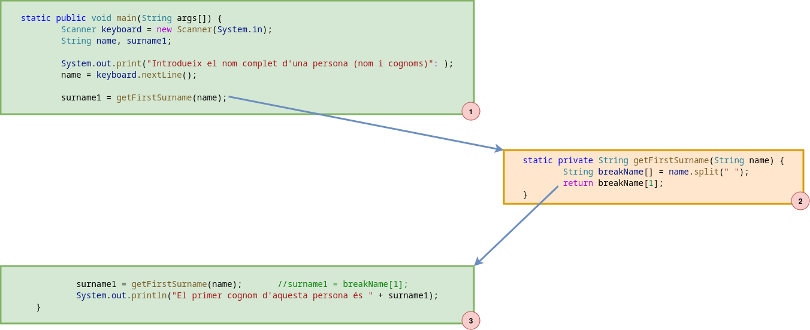

# Control de flux modular
A mesura que els programes creixen, tant en nombre d'instruccions com en complexitat, és molt possible que s'hagin d'implementar les mateixes funcionalitats (característiques) en diversos punts i es fa necessari modularitzar i organitzar el codi per fer-lo més llegible, fàcilment ampliable, de més fàcil manteniment i, sobretot, per evitar el *copy/paste* i tots els problemes que se'n deriven.

Per facilitar aquesta organitzaió i modularitat del codi apareix el control de fluxe modular o, dit d'altra manera, **les funcions i els procediments**. D'aquesta manera es passa del paradigma de *programació estructurada*, que és el que s'ha treballat fins ara, al paradigma de *programació modular*, basat en el disseny modular.

## Programació modular
La programació modular és un paradigma de programació que consisteix en analitzar un programa i totes les seves funcionalitats per tal de poder-lo dividir en mòduls (subprogrames, algorismes) més petits i senzills que el facin més llegible i sostenible. En aquest context, s'entén que un programa és sostenible si es pot mantenir i ampliar fàcilment i si els errors que pugui tenir són relativament fàcils de trobar i corregir gràcies a la seva modularització.

Els mòduls o subprogrames en què queda dividit el programa principal són, justament, les funcions i els procediments que s'han anomenat al principi d'aquest capítol.

L'anàlisi del programa principal i la seva divisió en mòduls també es pot anomenar *disseny modular* o *anàlisi descendent (top-down)*.

## Programa principal: la funció o procediment `main`
Tal com ja sabem, tot programa ha de definir el seu procés prinipal, que és el seu punt d'entrada. Aquest procés ha de ser únic i, en molts llenguatges de programació, es defineix com una funció o procediment especial que s'anomena `main`.

Podem dir que el `main` conté l'esquelet del programa, el qual ha de ser fàcil de seguir i llegir, i utilitza les funcions i els procediments per implementar les diverses funcionalitats requerides.

## Funcions i procediments
Les funcions i els procediments són **blocs de codi** que permeten implementar un algorisme (una tasca) molt específica i que tenen unes característiques especials:
* Són **independents**, és a dir, no estan situats dins del programa principal, sinó que s'implementen fora
* Poden ser **invocats** (cridats) des del programa principal o des de qualsevol altra funció o procediment per tal de ser executats
* Tenen un **nom identificatiu** per poder-ne fer la invocació
* S'encarreguen d'implementar algorismes, és a dir, de **fer càlculs i retornar resultats**, per tant, en cap moment gestionaran la interacció amb l'usuari; aquesta interacció sempre s'implementarà dins del programa principal
* Poden rebre dades d'entrada, anomenades **paràmetres**, que són les que necessitaran per poder dur a terme els càlculs que han d'implementar
* Poden **retornar valors**

### Sintaxi bàsica d'una funció o d'un procediment
Les funcions i els procediments estan formats per una **capçalera** i un **cos**, de tal manera que:
* Capçalera: defineix el nom de la funció o procediment, les dades d'entrada que rep (paràmetres) i les dades que retorna; també es pot anomenar *signatura* o *prototipus*.
* Cos: és el bloc de codi, el conjunt d'instruccions, que s'han d'executar cada cop que s'invoca la funció o el procediment.

El codi següent mostra, de manera esquemàtica, la sintaxi, és a dir, l'aspecte que tenen totes les funcions i els procediments. Cal tenir en compte, però, que aquesta sintaxi és específica per aquelles funcions i procediments JAVA que s'implementen dins del mateix fitxer del programa principal, és a dir, dins del mateix fitxer on es troba el `main`. En capítols posteriors es veurà que la capçalera pot variar lleugerament.
```java
    //Capçalera
    static public/private tipus_retorn nomFunció(tipus_parametre1 nomParametre1, tipus_parametre2 nomParametre2) {
        /**
         * Cos
         * Instruccions que s'han d'executar cada cop que s'invoca la funció o el procediment
         */

        /**
         * En cas que calgui retornar un valor, l'última instrucció sempre serà la següent:
         * return valor;
         */
    }
```
Explicació dels elements de la capçalera:
* Paraula `static`: ja sabem que, en JAVA, el `main` porta l'etiqueta `static` al capdavant, la qual cosa està, en certa manera, relacionada amb el fet que només pot existir un únic `main` per cada programa que s'implementi. Amb la resta de funcions i procediments que s'han de cridar (invocar) des del `main` passa una cosa similar: per una banda, també han de ser úniques (no pot haver dos procediments o funcions amb el mateix nom) i, per l'altra, com que el `main` és `static`, tota funció o procediment que s'hagi de cridar dins del teu codi també ha de ser `static`.
En captítols posteriors s'acabarà d'explicar en profunditat què significa, realment, que una funció o un procediment sigui `static` i quines implicacions té.
* Paraula `public` o `private`: tot i que aquestes paraules clau també s'explicaran en més profunditat en capítols posteriors, en termes generals podem dir que si una funció o procediment és `public` significa que es pot invocar des de qualsevol lloc i, específicament, es pot invocar des de funcions implementades en altres fitxers o des de l'exterior. Com que el `main` és el punt d'entrada (el procés principal) de tot programa, s'ha de poder invocar des de l'exterior (des d'un terminal, per exemple) i, per tant, ha de ser `public`. En canvi, si una funció o procediment és `private` significa que només es pot invocar des d'altres funcions i procediments implementats dins del mateix fitxer.
En el punt d'aprenentatge actual, com que totes les funcions i procediments s'implementaran dins del mateix fitxer del `main` amb l'objectiu que només es puguin invocar des d'aquest `main` o des d'altres funcions i procediments del mateix fitxer, la paraula clau `private` és preferible a la paraula clau `public`.
* Tipus de retorn: la única diferència entre les funcions i els procediments recau en el fet de si retornen valors o no. Els procediments no retornen res, per tant, el seu tipus de retorn serà `void` (nul, res, buit). Les funcions, en canvi, retornen valors i, per tant, el seu tipus de retorn pot ser qualsevol que es necessiti (`int`, `char`, `String`, `boolean`, `Integer`, etc.). Lligat a aquest fet cal tenir en compte que l'última instrucció que haurà d'executar una funció és un `return` (s'explicarà amb més profunditat més endavant).
* Nom de la funció (o procediment): el nom de tota funció i procediment ha de ser únic (en capítols posteriors veurem que hi ha algunes excepcions) i ha de complir exactament les mateixes normes que els noms de les variables:
  1. **Ha de ser únics**
  2. Ha d'estar **relacionat amb l'algorisme que implementa** la funció o el procediment
  3. Com que el llenguatge **Java és *case-sensitive***, s'ha de **distingir minúcules i majúscules**
  4. **Poden contenir lletres, números i subguions (`_`)**, però mai poden contenir caràcters especials (accents, espais en blanc, lletres especials com la `ñ` o la `ç`, símbols com `!`, `)`, etc.)
  5. Sempre han de **començar amb una lletra o un subguió** (main poden començar amb un número)
  6. Sempre han de **començar en minúscules**; la resta del nom es pot fer utilitzant *camel-case* (posant en majúscula les primeres lletes de les diverses paraules que componen el nom) o unint les diverses paraules amb subguions, tot dependrà de l'estil propi del programador. 
  7. **No es poden utilitzar les paraules reservades** del llenguatge per definir el nom
* Paràmetres: cada funció o procediment pot rebre un conjunt de paràmetres, que són les dades d'entrada que necessita per poder fer els càlculs. Aquest paràmetres es defineixen entre els parèntesis que es posen tot seguit del nom de la funció o procediment i s'especifíquen com un llistat separat per comes (,) on cada element ha d'indicar el tipus del paràmetre i un nom (aquest nom ha de complir les mateixes normes que els noms de les variables). Si una funció o un procediment no rep cap paràmetre, els parèntesis es deixen buits.

Exemplificacions:
```java
    //El punt d'entrada main és un procediment static i public que només rep 1 únic paràmetre, un array d'Strings:
    static public void main(String args[]) {
        //Codi main
    }

    //Procediment static i private que no rep cap paràmetre:
    static private void proc1() {
        //Codi proc1
    }

    //Funció static i private que retorna un enter i que no rep cap paràmetre:
    static private int func1() {
        int value = 10;
        //Codi func1

        return value;
    }

    //Funció static i private que retorna un String i que no rep dos paràmetres:
    static private String func2(String name, int age) {
        String firstSurname;
        //Codi func2

        return firstSurname;
    }
```

### Crida d'una funció o d'un procediment
Un cop definida o implementada una funció o un procediment utilitzant la sintaxi de l'apartat anterior cal fer-ne ús per tal que el codi que conté es pugui executar. Per aconseguir-ho, aquesta funció o aquest procediment s'ha de *cridar*, sigui des del procediment `main`, sigui des d'una altra funció o procediment.

La **crida** d'una funció, que també es pot dir *invocació*, és aquella instrucció que, en exercutar-se, permet accedir al codi intern de la funció o procediment per executar-lo i, un cop executat, retornar al mateix punt de la crida per continuar executant el codi principal.

Per poder cridar una funció o un procediment en cap conéixer la seva capçalera (o signatura) ja que la invocació consisteix en utilitzar el nom de la funció o mètode seguit dels parèntesis amb el llistat de tots els paràmetres que necessita (només els valors, sense els tipus).

Exemplificacions:

```java
    static public void main(String args[]) {
        Scanner keyboard = new Scanner(System.in);
        String name, surname1;

        System.out.print("Introdueix el nom complet d'una persona (nom i cognoms): ");
        name = keyboard.nextLine();

        surname1 = getFirstSurname(name);       //Crida a la funció getFirstName()

        System.out.println("El primer cognom d'aquesta persona és " + surname1);
    }

    static private String getFirstSurname(String name) {
        String breakName[] = name.split(" ");
        return breakName[1];
    }
```




La Figura 11.1 mostra com s'executa el codi mostrat en l'exemple anterior. Podem veure que primer s'inicia l'execució del procediment `main`; quan aquest procediment arriba a la invocació de la funció `getFirstSurname()` la seva execució queda congelada i es passa a executar el codi de la funció. Finalment, quan la funció acaba, l'execució retorna al punt de la crida, retornant el valor calculat dins de la funció i emmagatzemant-lo a la variable `surname1`. A partir d'aquí, l'execució del `main` continua amb normalitat fins a la seva finalització.


### Pas de paràmetres
#### Pas de paràmetres per valor
#### Pas de paràmetres per referència