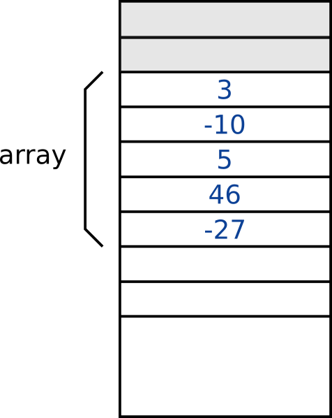

# *Arrays*
Un *array* és una **estructura de dades estàtica** que permet emmagatzemar **múltiples elements** d'un mateix tipus.

## Aspecte d'un *array* dins de la memòria *RAM*
Tal com s'ha dit en les línies de sobre, un *array* és una estructura de dades **estàtica**. Això significa que, un cop se n'estableix la seva mida, és a dir, la seva capacitat (el nombre d'elements totals que pot emmagatzemar), ja no es pot canviar. És a dir, l'estructura ja no es pot fer ni més gran ni més petita i, en cas de voler-ne canviar la grandària, l'única solució és crear un *array* nou.

Quan es crea un *array*, els seus elements queden emmagatzemats a *RAM* de manera seqüencial o consecutiva, un darrere de l'altre, tal com mostra la Figura 12.1, on s'hi veu un *array* amb capacitat per a 5 nombres enters.
<figure>
    
    <figcaption>Figura 12.1: Array emmagatzemat a la RAM</figcaption>
</figure>