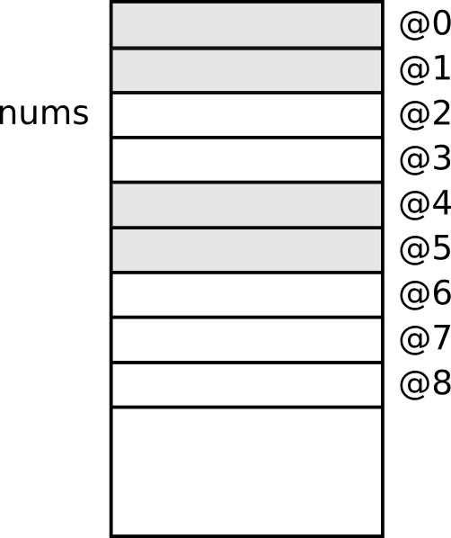
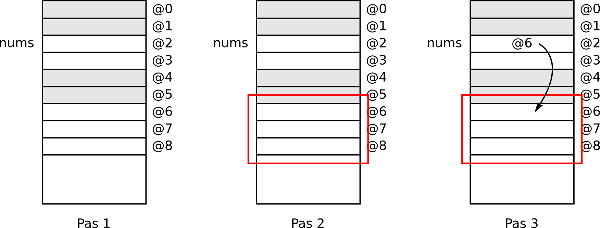
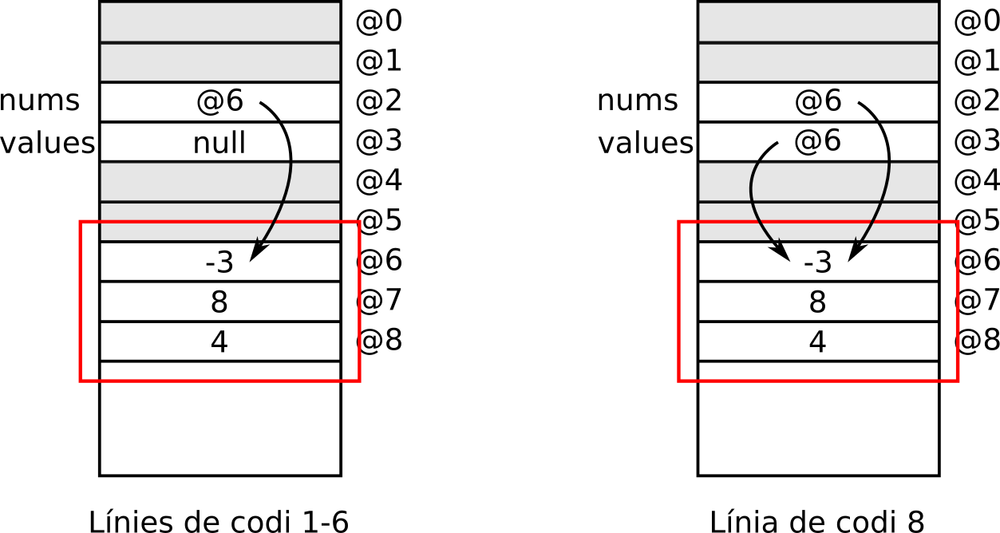
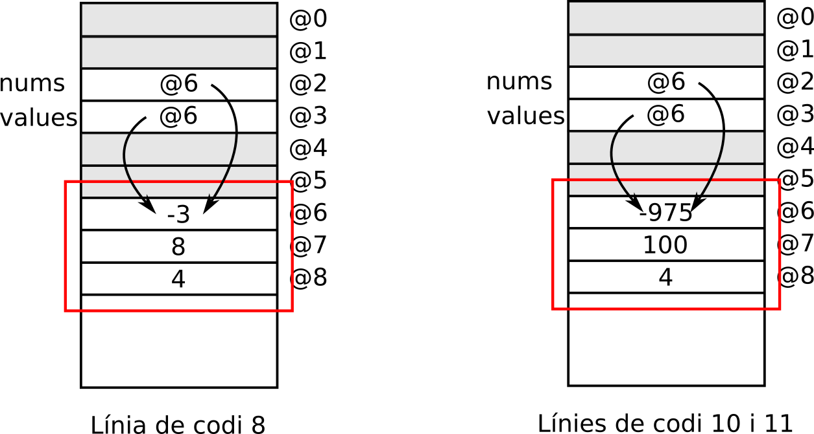
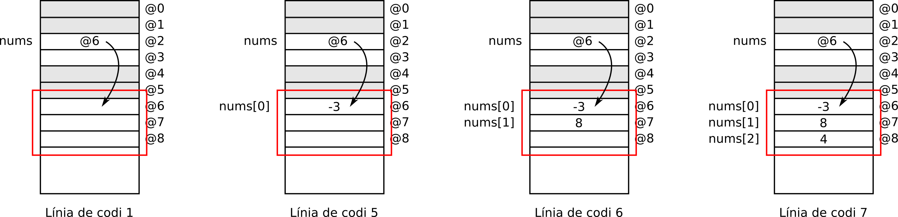

# *Arrays*
Un *array* és una **estructura de dades estàtica** que permet emmagatzemar **múltiples elements** d'un mateix tipus.

## Aspecte d'un *array* dins de la memòria *RAM*
Tal com s'ha dit en les línies de sobre, un *array* és una estructura de dades **estàtica**. Això significa que, un cop se n'estableix la seva mida, és a dir, la seva capacitat (el nombre d'elements totals que pot emmagatzemar), ja no es pot canviar. És a dir, l'estructura ja no es pot fer ni més gran ni més petita i, en cas de voler-ne canviar la grandària, l'única solució és crear un *array* nou.

Quan es crea un *array*, els seus elements queden emmagatzemats a *RAM* de manera seqüencial o consecutiva, un darrere de l'altre, tal com mostra la Figura 12.1, on s'hi veu un *array* amb capacitat per a 5 nombres enters.
<figure>
    
    <figcaption>Figura 12.1: array emmagatzemat a la RAM</figcaption>
</figure>

## Declaració i inicialització d'un *array*
Per poder declarar i inicialitzar un *array* necessitem utilitzar l'operador `[]`, el qual indica que la variable que estem creant és un llistat *unidimensional* d'elements. Així doncs, la Figura 12.2 mostra les dues maneres que existeixen de crear arrays, mentre que la Figura 12.3 mostra exemples concrets


```java
    tipus_dades []nom_array1;
    tipus_dades nom_array2[];
```



```java
    int nums[];
    String subjects[];
    float prices[];
    char listOptions[];
    Boolean flags[];
```


Un cop declarat l'*array*, s'ha d'inicialitzar, de tal manera que aquesta inicialització té 3 nivells de completesa:
1. L'*array* s'inicialitza completament buit (`null`), de tal manera que no se'n defineix cap mida i, per tant, no està preparat per poder-se fer servir.
2. L'*array* s'inicialitza amb una mida determinada però sense cap element a dins.
3. S'inicialitzen els valors per cadascuna de les posicions d'un *array* que ja té assignada una capacitat.

### Inicialització d'un array a `null`
Quan encara no sabem quina capacitat final tindrà un *array*, un cop declarat, s'ha d'inicialitzar a `null`. Això indica que la memòria *RAM* de l'*array* encara no ha estat preparada per a poder emmagatzemar valors (vegeu la Figura 12.4 i la Figura 12.5)


```java
    int nums[] = null;

    if(nums == null) {          //Retornarà true
        System.out.println("L'array és null");
    }
```


<figure>
    
    <figcaption>Figura 12.5: inicialització d'un array a null</figcaption>
</figure>

### Inicialització d'un array amb una mida determinada (sense elements)
En cas que en el moment de la declaració ja es conegui la capacitat final del nou *array*, se'n pot fer la seva inicialització utilitzant l'operador `new`, tal com mostra la Figura 12.6.


```java
    tipus_dades []nom_array1 = new tipus_dades[capacitat];
    tipus_dades nom_array2[] = new tipus_dades[capacitat];
```


L'operador `new` seguit de l'operador `[]` permet crear un nou *array* amb la capacitat indicada entre `[]`. Un cop un *array* ja té la seva grandària definida, aquest valor es pot consultar mitjançant l'atribut `length` (vegeu la línia 11 del codi de la Figura 12.7).

La Figura 12.7 mostra un exemple de codi real

```java
    int capacity = 3;
    int nums[] = new int[3];
    float values[];
    values = new float[capacity];

    if(nums == null) {          //Retornarà false
        System.out.println("L'array és null");
    } else {
        System.out.println("L'array ja té la memòria reservada " +
                "per poder emmagatzemar els seus elements\n" +
                "Pot emmagatzemar " + nums.length + " elements");
        System.out.println("Els elements de l'array es començaran " +
                "a emmagatzemar a partir de la posició de memòria " +
                nums);
    }
```


Si continuem fent el resseguiment de l'*array* `nums`, la Figura 12.8 mostra què passa a la *RAM* quan es declara i s'inicialitza la mida d'un *array* (passaria el mateix per a `values`). Els passos que se segueixen quan s'executa la línia de codi 2 són els següents:
1. S'associa una posició de memòria a la variable `nums` (tal com també mostra la Figura 12.5); en aquest cas, la posició `@2`. Aquesta variable és una **referència**, és a dir, el seu contingut no serà un valor de tipus `int`, sinó que contindrà la posició de la memòria a partir de la qual es començaran a emmagatzemar els seus elements (per tal que us en pugueu fer una idea mental, emmagatzema una *fletxa* que apunta a la 1a posició de memòria que ocuparan els seus elements).
2. Es busca un espai a memòria que contingui tantes posicions consecutives com elements ha de contenir l'*array* (en el cas d'aquest exemple, ha de trobar 3 espais de memòria lliures seguits).
3. Quan troba aquests espais, actualitza la **referència** de l'*array* (la posició `@2` del punt 1) per tal que apunti a la posició que contindrà el primer element.

<figure>
    
    <figcaption>Figura 12.8: inicialització de la mida d'un array</figcaption>
</figure>

#### Concepte **referència**
El fet que la variable associada a un *array* (en l'exemple que anem resseguint, `nums`) sigui, en realitat, una **referència** que *apunta* a la primera posició de memòria on troben els seus elements té conseqüències importants en el moment de gestionar aquests espais de memòria:
1. Assignació de referències
2. *Garbage collector*

##### Assignació de referències
Quan s'igualen dues **referències** (dues variables associades a *arrays*, en aquest cas) el que s'està fent és crear dos *apuntadors* al mateix espai de memòria. Per entendre-ho més clarament, vegeu el codi de la Figura 12.9 i com es tradueix dins de la memòria *RAM* en la Figura 12.10


```java
    int nums[] = new int[3];
    int values[] = null;

    nums[0] = -3;
    nums[1] = 8;
    nums[2] = 4;

    values = nums
```


La línia 8 de la Figura 12.9 no està igualant el contingut dels *arrays*, sinó que n'iguala les referències, de tal manera que la *RAM* que en resulta és la de la Figura 12.10.

<figure>
    
    <figcaption>Figura 12.10: assignació de referències d'arrays</figcaption>
</figure>

Com que les **referències** `nums` com `values` tenen accés al mateix *array* (a la mateixa regió de memòria), podem fer-hi modificacions utilitzant tant `nums` com `values` (vegeu les Figures 12.11 i 12.12).


```java
    int nums[] = new int[3];
    int values[] = null;

    nums[0] = -3;
    nums[1] = 8;
    nums[2] = 4;

    values = nums

    values[1] = 100;
    nums[0] = -975 
```


<figure>
    
    <figcaption>Figura 12.12: modificació de l'array a través de múltiples referències</figcaption>
</figure>

##### *Garbage collector*
Quan una regió de memòria, en aquest cas un *array*, no té associada cap **referència** passa a ser inaccessible (memòria *zombie*). Això significa que el programa està gastant recursos de manera extremadament ineficient.

Per solucionar aquests problemes, la màquina virtual de Java activa el *Garbage Collector*, que detecta aquesta memòria *zombie* i l'allibera, retornant els recursos al sistema.

### Inicialització dels elements d'un *array*
Per tal d'inicialitzar els elements d'un *array* cal tenir en compte que, prèviament, se n'ha hagut de definir la seva capacitat. En cas contrari, el programa llençarà un `NullPointerException`.

La inicialització es pot fer de dues maneres:
1. Utilitzant l'operador `{}`, el qual permet inicialitzar la capacitat i els elements de l'*array* d'un sol cop
2. Utilitzant l'operador `[]` per inicialitzar, posició a posició, cadascun dels elements de l'*array* un cop ja se n'ha definit la capacitat.

Cal tenir en compte que, en informàtica, l'accés a les posicions d'un *array* sempre comença pel 0, és a dir,
* el primer element es trobarà a la posició 0;
* el segon element es trobarà a la posició 1;
* el tercer element es trobarà a la posició 2 i
* i així successivament.
Molts cops, aquesta *posició* també s'anomena l'*índex* de l'*array*.

La Figura 12.13 mostra, de manera esquemàtica, l'ús de tots dos operadors (`{}` i `[]`) per inicialitzar els valors emmagatzemats dins d'un array. En canvi, la Figura 12.14 mostra un exemple de codi real


```java
    //Operador {}: inicialitza capacitat i valors interns a la vegada
    tipus_dades []nom_array1 = {valor1, valor2, valor3, ...};
    tipus_dades nom_array2[] = {valor1, valor2, valor3, ...};

    //Operador d'accés per posició []: inicialitza el valor per cada posició de manera individual
    tipus_dades []nom_array3 = new tipus_dades[capacitat];
    nom_array3[0] = valor1;
    nom_array3[1] = valor2;
    nom_array3[2] = valor3;
    //...

    tipus_dades nom_array4[] = new tipus_dades[capacitat];
    nom_array4[0] = valor1;
    nom_array4[1] = valor2;
    nom_array4[2] = valor3;
    //...
```



```java
    int nums[] = new int[3];
    float values[] = {-3.1f, 8.0f, 4.54f};
    String names[] = null;

    nums[0] = -3;
    nums[1] = 8;
    nums[2] = 4;

    String singleName = "Mireia";
    names[0] = singleName;          //Llençarà un NullPointerException
```


Continuant el resseguiment de l'*array* `nums`, la Figura 12.14 mostra què passa a la *RAM* quan es declara i s'inicialitza la mida i els elements d'un *array* (passaria el mateix per a `values`).

<figure>
    
    <figcaption>Figura 12.14: inicialització dels valors emmagatzemats dins d'un array</figcaption>
</figure>

## Accés per posició als elements d'un *array*
Un cop un array ha estat inicialitzat i té definida una capacitat específica, es pot accedir a cadascun dels elements emmagatzemats utilitzant l'operador d'accés per posició `[]`.

Així doncs, si un *array* té capacitat per a `N` elements, les posicions, també anomenades *índexos*, a les quals es pot accedir van de la `0` a la `N-1` (dit d'altra manera, de `0` a `length-1`). Per tant, cal tenir en ment que els ordinadors sempre ***comencen a comptar des del 0***. En cas que s'intenti accedir a un índex (una posició) fora de rang (per exemple, un valor negatiu o superior a `length-1`), el programa acabarà llençant l'excepció `ArrayIndexOutOfBoundsException`

La Figura 12.15 mostra diversos exemples de manipulació dels elements d'un *array*, tant en accés per a lectura com en accés per a escriptura.


```java
    int nums[] = new int[3];
    float values[] = {-3.1f, 8.0f, 4.54f};
    String names[] = null;
    int num1;
    float num2;

    /**
     * Assignació dels valors a cadascuna de les
     * posicions de l'array nums.
     * Les posicions correctes van de 0 a nums.length-1.
     */
    nums[0] = -3;
    nums[1] = 8;
    nums[2] = 4;

    nums[-1] = 3;                   //Llençarà un ArrayIndexOutOfBoundsException
    nums[7] = 90;                   //Llençarà un ArrayIndexOutOfBoundsException

    /**
     * Exemples de múltiples operacions accedint
     * a les posicions dels arrays de manera individual
     */
    num2 = values[0] + values[2];
    nums[0] = (int) num2;
    values[0] = num2 * nums[2];

    String singleName = "Mireia";
    names[0] = singleName;          //Llençarà un NullPointerException
```
