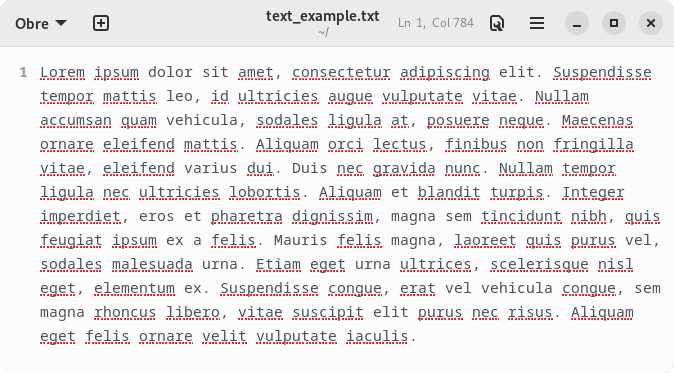
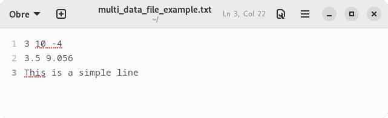

# Lectura i escriptura de fitxers de text
En el moment d'implementar un programa és molt important tenir en compte la **persistència de dades**, és a dir, la capacitat de poder-les emmagatzemar i recuperar en qualsevol moment. Per assolir aquest objectiu hi ha dues eines bàsiques: els fitxers i les bases de dades persistents.

Aquest capítol tracta la persistència de dades en fitxers a través de la seva lectura i escriptura.

## Fitxers de text
Entendrem com a *fitxer de text* qualsevol document que s'hagi escrit mitjançant un editor de text bàsic i que contingui text en pla, és a dir, sense cap mena de format enriquit (negreta, cursiva, imatges, enllaços, etc.). Les extensions de fitxers més habituals en aquests casos són `txt` i `csv`.

Addicionalment, fitxers amb formats de tipus `html`, `xml`, `json`, etc., també es poden tractar com a fitxers de text tenint en compte que, qualsevol tipus de format desapareixerà si no se'n fa l'adaptació correcta de manera manual.

## Lectura bàsica d'un fitxer de text
Java ens ofereix 3 classes bàsiques per llegir un fitxer de text:
1. `FileReader`: lector bàsic;
2. `BufferedReader`: lector eficient i
3. `Scanner`: lector per tractar diferents tipus de dades

## `FileReader`
La classe `FileReader`, que es troba dins del *package* `java.io`, permet obrir un fitxer en mode lectura a partir de la seva ruta (que pot ser absoluta o relativa).
```java
//Utilitzant una ruta relativa (en un sistema Linux)
FileReader freader = new FileReader("files/myfile.txt");


//Utilitzant una ruta relativa (en un sistema Windows)
FileReader freader = new FileReader("files\\myfile.txt");

//Utilitzant una ruta relativa (multiplataforma)
FileReader freader = new FileReader("files" + File.separator + "myfile.txt");
```
Aquesta obertura pot provocar una `FileNotFoundException` si el fitxer no existeix o si la ruta especificada no és correcta i, per tant, no s'ha pogut trobar el document. Aquesta excepció, que també es troba dins del *package* `java.io`, no és *bloquejant* i es pot tractar per evitar que el programa falli i aturi la seva execució. Aquest tractament, però, s'estudiarà més endavant.

La classe `FileReader` ofereix el mètode `int read()`, el qual llegeix caràcter a caràcter, retornant-ne el seu codi *Unicode* (en cas que no hi hagi més caràcters per llegir retorna -1). Aquesta lectura, però, és **molt ineficient**, ja que per cada caràcter individual a llegir ha de fer un accès a memòria secundària (disc dur), procès que és molt lent.

Un cop acabat de llegir el fitxer, cal tancar el `FileReader` mitjançant el mètode `void close()` per tancar i alliberar el fitxer i retornar els recursos al sistema.

La Figura 17.1 mostra l'exemple d'un fitxer de text i la Figura 17.2 mostra el codi necessari per poder-ne fer la lectura mitjançant la classe `FileReader`.




```java
public void readFile(String filename) throws FileNotFoundException {
    FileReader freader = new FileReader(filename);
    int ccode = freader.read();
    while(ccode != -1) {
        System.out.print(String.valueOf((char) ccode));
        ccode = freader.read();
    }
    freader.close()
}
```


## `BufferedReader`
La classe `BufferedReader`, dins del *package* `java.io`, fa una lectura més eficient dels fitxers de text ja que, internament, gestiona un *búffer* que permet llegir múltiples caràcters a la vegada i, per tant, disminueix el nombre d'accessos a memòria secundària.

Així doncs, aquesta classe no només té el mètode `int read()` que llegeix cada caracter de manera individual, sinó que també té el mètode `String readLine()`, el qual llegeix i retorna línies senceres i quan acaba el fitxer, retorna `null`.

Per poder llegir un fitxer mitjançant un `BufferedReader` cal crear, prèviament, un `FileReader`, ja que aquesta és la classe encarregada d'obrir el fitxer en mode lectura. A més a més, un cop acabada la lectua, també caldrà tancar el `BufferedReader` mitjançant el mètode `void close()`, el qual, al seu torn, també tancarà el `FileReader` intern.

La Figura 17.3 mostra l'exemple d'un fitxer de text amb múltiples línies i la Figura 17.4 mostra el codi necessari per poder-ne fer la lectura mitjançant la classe `BufferedReader`.



```java
public void readFile(String filename) throws FileNotFoundException {
    FileReader freader = new FileReader(filename);
    BufferedReader breader = new BufferedReader(freader);
    String line = breader.readLine();
    while(line != null) {
        System.out.println(line);
        line = breader.readLine();
    }
    breader.close()
}
```



**Important:** la lectura de fitxer sempre haurà de ser el més eficient possible, per tant, sempre haurà d'involucrar el `BufferedReader`.


## `Scanner`
La classe `Scanner`, dins del *package* `java.io`, i que també s'utilitza per fer l'entrada de dades des de teclat, ofereix tots els mètodes necessaris per tal de poder tractar les dades de forma correcta segons el seu tipus. Per tant, permet llegir
* *paraules*: `String next()`;
* línies: `String nextLiine()`;
* nombres: `int nextInt()`,  `float nextFloat()`, `double nextDouble()`, etc.;
* booleans: `boolean nextBoolean()`
* etcètera

Per crear un lector de tipus `Scanner` necessitarem un `FileReader` (la lectura serà ineficient) o un `BufferedReader` (la lectura serà eficient). Ara però, com ja s'ha esmentat en l'apartat anterior, la lectura d'un fitxer sempre ha de ser eficient, per tant, sempre es crearà l'`Scanner` per sobre d'un `BufferedReader`. A més a més, com passa amb els altres tipus de `Readers`, un cop finalitzada la lectura del fitxer, caldrà tancar l'`Scanner` i alliberar els recursos.

Cal tenir en compte que, així com l'ús del `BufferedReader` es pot considerar obligatori, l'ús de l'`Scanner` no ho és i, per tant, es deixa a criteri del desenvolupador el seu ús, segons si es necessiten els mètodes de format de dades o no.

La Figura 17.5 mostra l'exemple d'un fitxer de text amb múltiples tipus de dades i la Figura 17.6 mostra el codi necessari per poder-ne fer la lectura mitjançant la classe `Scanner`.




```java
public void readFile(String filename) throws FileNotFoundException {
    FileReader freader = new FileReader(filename);
    BufferedReader breader = new BufferedReader(freader);
    Scanner sreader = new Scanner(breader);
    int num;
    float decim;
    String line;

    while(sreader.hasNextInt()) {
        num = sreader.nextInt();
        System.out.println(num);
    }

    while(sreader.hasNextFloat()) {
        decim = sreader.nextFloat();
        System.out.println(decim);
    }
    
    line = sreader.nextLine();
    System.out.println(line);

    sreader.close()
}
```



**Important:** les Figures 17.2, 17.4 i 17.6 mostren una lectura molt senzilla de les dades dels fitxers, pensada, únicament, per mostrar la informació per pantalla. Si cal un tractament més elaborat i una anàlisi de les dades que conté el fitxer cal utilitzar els mètodes de tractament d'`String` (vegeu el [Capítol 8](chapter8.md)) i diverses operacions matemàtiques.
