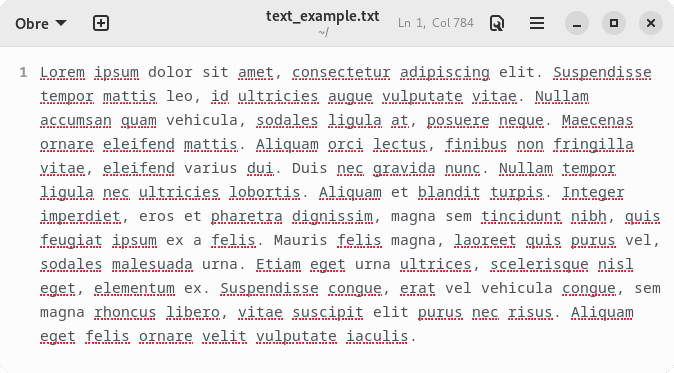
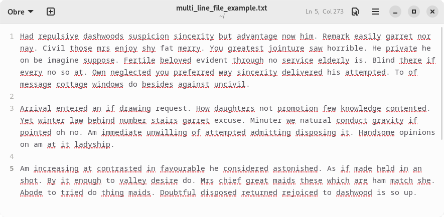
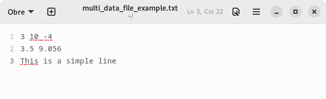
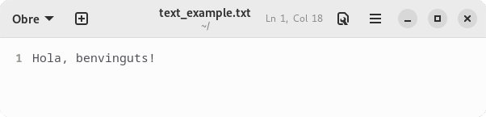
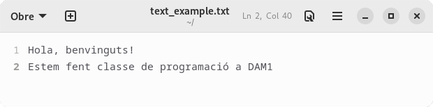
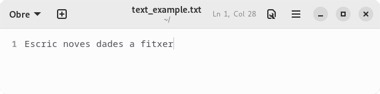

# Lectura i escriptura de fitxers de text
En el moment d'implementar un programa és molt important tenir en compte la **persistència de dades**, és a dir, la capacitat de poder-les emmagatzemar i recuperar en qualsevol moment. Per assolir aquest objectiu hi ha dues eines bàsiques: els fitxers i les bases de dades persistents.

Aquest capítol tracta la persistència de dades en fitxers a través de la seva lectura i escriptura.

## Gestió del sistema de fitxers
TODO

## Fitxers de text
Entendrem com a *fitxer de text* qualsevol document que s'hagi escrit mitjançant un editor de text bàsic i que contingui text en pla, és a dir, sense cap mena de format enriquit (negreta, cursiva, imatges, enllaços, etc.). Les extensions de fitxers més habituals en aquests casos són `txt` i `csv`.

Addicionalment, fitxers amb formats de tipus `html`, `xml`, `json`, etc., també es poden tractar com a fitxers de text tenint en compte que, qualsevol tipus de format desapareixerà si no se'n fa l'adaptació correcta de manera manual.

## Lectura bàsica d'un fitxer de text
Java ens ofereix 3 classes bàsiques per llegir un fitxer de text:
1. `FileReader`: lector bàsic;
2. `BufferedReader`: lector eficient i
3. `Scanner`: lector per tractar diferents tipus de dades

## `FileReader`
La classe `FileReader`, que es troba dins del *package* `java.io`, permet obrir un fitxer en mode lectura a partir de la seva ruta, que pot ser absoluta o relativa.
```java
//Utilitzant una ruta relativa (en un sistema Linux)
FileReader freader = new FileReader("files/myfile.txt");


//Utilitzant una ruta relativa (en un sistema Windows)
FileReader freader = new FileReader("files\\myfile.txt");

//Utilitzant una ruta relativa (multiplataforma)
FileReader freader = new FileReader("files" + File.separator + "myfile.txt");
```
Aquesta obertura pot provocar una `FileNotFoundException` si el fitxer no existeix o si la ruta especificada no és correcta i, per tant, no s'ha pogut trobar el document. Aquesta excepció, que també es troba dins del *package* `java.io`, no és *bloquejant* i es pot tractar per evitar que el programa falli i aturi la seva execució. Aquest tractament, però, s'estudiarà més endavant.

La classe `FileReader` ofereix el mètode `int read()`, el qual llegeix caràcter a caràcter, retornant-ne el seu codi *Unicode* (en cas que no hi hagi més caràcters per llegir retorna -1). Aquesta lectura, però, és **molt ineficient**, ja que per cada caràcter individual a llegir ha de fer un accès a memòria secundària (disc dur), procès que és molt lent.

Un cop acabat de llegir el fitxer, cal tancar el `FileReader` mitjançant el mètode `void close()` per tancar i alliberar el fitxer i retornar els recursos al sistema.

La Figura 19.1 mostra l'exemple d'un fitxer de text i la Figura 19.2 mostra el codi necessari per poder-ne fer la lectura mitjançant la classe `FileReader`.




```java
public String readFile(String filename) throws FileNotFoundException {
    FileReader freader = new FileReader(filename);
    String filecontent = "";
    int ccode = freader.read();
    while(ccode != -1) {
        filecontent += String.valueOf((char) ccode);
        ccode = freader.read();
    }
    freader.close();

    return filecontent;
}
```


## `BufferedReader`
La classe `BufferedReader`, dins del *package* `java.io`, fa una lectura més eficient dels fitxers de text ja que, internament, gestiona un *búffer* que permet llegir múltiples caràcters a la vegada i, per tant, disminueix el nombre d'accessos a memòria secundària.

Així doncs, aquesta classe no només té el mètode `int read()` que llegeix cada caracter de manera individual, sinó que també té el mètode `String readLine()`, el qual llegeix i retorna línies senceres i quan acaba el fitxer, retorna `null`.

Per poder llegir un fitxer mitjançant un `BufferedReader` cal crear, prèviament, un `FileReader`, ja que aquesta és la classe encarregada d'obrir el fitxer en mode lectura. A més a més, un cop acabada la lectua, també caldrà tancar el `BufferedReader` mitjançant el mètode `void close()`, el qual, al seu torn, també tancarà el `FileReader` intern.

La Figura 19.3 mostra l'exemple d'un fitxer de text amb múltiples línies i la Figura 19.4 mostra el codi necessari per poder-ne fer la lectura mitjançant la classe `BufferedReader`.




```java
public String readFile(String filename) throws FileNotFoundException {
    FileReader freader = new FileReader(filename);
    BufferedReader breader = new BufferedReader(freader);
    String filecontent = "";
    String line = breader.readLine();
    while(line != null) {
        filecontent += line;
        line = breader.readLine();
    }
    breader.close();

    return filecontent;
}
```



**Important:** la lectura de fitxer sempre haurà de ser el més eficient possible, per tant, sempre haurà d'involucrar el `BufferedReader`.


## `Scanner`
La classe `Scanner`, dins del *package* `java.io`, i que també s'utilitza per fer l'entrada de dades des de teclat, ofereix tots els mètodes necessaris per tal de poder tractar les dades de forma correcta segons el seu tipus. Per tant, permet llegir
* *paraules*: `String next()`;
* línies: `String nextLiine()`;
* nombres: `int nextInt()`,  `float nextFloat()`, `double nextDouble()`, etc.;
* booleans: `boolean nextBoolean()`
* etcètera

Per crear un lector de tipus `Scanner` necessitarem un `FileReader` (la lectura serà ineficient) o un `BufferedReader` (la lectura serà eficient). Ara però, com ja s'ha esmentat en l'apartat anterior, la lectura d'un fitxer sempre ha de ser eficient, per tant, sempre es crearà l'`Scanner` per sobre d'un `BufferedReader`. A més a més, com passa amb els altres tipus de `Readers`, un cop finalitzada la lectura del fitxer, caldrà tancar l'`Scanner` i alliberar els recursos.

Cal tenir en compte que, així com l'ús del `BufferedReader` es pot considerar obligatori, l'ús de l'`Scanner` no ho és i, per tant, es deixa a criteri del desenvolupador el seu ús, segons si es necessiten els mètodes de format de dades o no.

La Figura 19.5 mostra l'exemple d'un fitxer de text amb múltiples tipus de dades i la Figura 19.6 mostra el codi necessari per poder-ne fer la lectura mitjançant la classe `Scanner`.




```java
public void readFile(String filename) throws FileNotFoundException {
    FileReader freader = new FileReader(filename);
    BufferedReader breader = new BufferedReader(freader);
    Scanner sreader = new Scanner(breader);
    int num;
    float decim;
    String line;

    while(sreader.hasNextInt()) {
        num = sreader.nextInt();
    }

    while(sreader.hasNextFloat()) {
        decim = sreader.nextFloat();
    }
    
    line = sreader.nextLine();

    sreader.close();
}
```



**Important:** les Figures 19.2, 19.4 i 19.6 mostren una lectura molt senzilla de les dades dels fitxers, pensada, únicament, per mostrar la informació per pantalla o, simplement, llegir-la. Si cal un tractament més elaborat i una anàlisi de les dades que conté el fitxer cal utilitzar els mètodes de tractament d'`String` (vegeu el [Capítol 8](chapter8.md)) i diverses operacions matemàtiques.

Per exemple, la Figura 19.7 refà l'exemple 19.4 per fer un còmput del nombre de paraules i de caràcters que conté el fitxer de la Figura 19.3.



```java
public int[] readFile(String filename) throws FileNotFoundException {
    FileReader freader = new FileReader(filename);
    BufferedReader breader = new BufferedReader(freader);
    int nwords = 0, nchars = 0;
    String line = breader.readLine();
    while(line != null) {
        nwords += line.split(" ").length;
        nchars += line.length();

        line = breader.readLine();
    }
    breader.close();

    return new int[]{nwords, nchars};
}
```


## Escriptura bàsica d'un fitxer de text
L'escriptura d'un fitxer de text segueix una estructura molt similar al procés de lectura que s'ha explicat a l'apartat anterior, de tal manera que Java també ofereix 3 classes bàsiques per assolir l'objectiu:
1. `FileWriter`: escriptor bàsic;
2. `BufferedWriter`: escriptor eficient i
3. `PrintWriter`: escriptor per tractar diferents tipus de dades

## `FileWriter`
La classe `FileWriter`, que es troba dins del *package* `java.io`, permet obrir un fitxer en mode escriptura a partir de la seva ruta, que pot ser absoluta o relativa; en cas que el fitxer no existeixi, el crea nou. Addicionalment també permet obrir el fitxer en mode *sobreescriptura* o en mode *append*. El mode *sobreescriptura* esborra completament el fitxer (en cas que ja existeixi) i en torna a crear el contingut. El mode *append*, en canvi, respecta el contingut preexistent al fitxer i afegeix les noves dades al final de tot.

```java
//Utilitzant una ruta relativa (en un sistema Linux)
//Mode sobreescriptura
FileWriter fwriter = new FileWriter("files/myfile.txt");


//Utilitzant una ruta relativa (en un sistema Windows)
//Mode sobreescriptura
FileWriter fwriter = new FileWriter("files\\myfile.txt", false);

//Utilitzant una ruta relativa (multiplataforma)
//Mode append
FileWriter fwriter = new FileWriter("files" + File.separator + "myfile.txt", true);
```
Aquesta obertura pot provocar una `IOException` si hi ha qualsevol error d'entrada/sortida durant l'intent d'obrir o crear el document en mode escriptura. Tal com passa amb l'excepció `FileNotFoundException`, la `IOException` també es troba dins del *package* `java.io` i no és *bloquejant*, per tant es pot tractar per evitar que el programa falli i aturi la seva execució.

La classe `FileWriter` ofereix diversos mètodes d'escriptura
* `void write(int c)`
* `void write(String str)`
* `Writer append(char c)`
* `Writer append(CharSequence seq)`: un `CharSequence` és pot considerar equivalent a un `String`

Malauradament, tot i que hi hagi mètodes per escriure `String`, el `FileWriter` és equivalent al `FileReader` pel que fa a eficiència i, per tant, escriu a fitxer caràcter a caràcter, fent que el procès sigui molt costós per l'elevat nombre d'accessos a memòria secundària (disc dur) que ha de realitzar.

Un cop acabat d'escriure el fitxer, cal tancar el `FileWriter` mitjançant el mètode `void close()`, el qual guarda les dades a fitxer, el tanca, l'allibera i retornar els recursos al sistema.


**Important:** si un fitxer obert en mode escriptura no es tanca, les dades no quedaran guardades i, per tant, es perdràn!


La Figura 19.8 mostra el codi necessari per poder-ne fer l'escriptura d'un fitxer `FileWriter` (mode *sobreescriptura*) i la Figura 19.9 en mostra el resultat.


```java
public void writeFile(String filename) throws IOException {
    FileWriter fwriter = new FileWriter(filename);
    String filecontent = "Hola, benvinguts!";
    for(int pos=0; pos<filecontent.length; pos++) {
        fwriter.write(filecontent.codePointAt(pos));
    }
    fwriter.close();
}
```




## `BufferedWriter`
La classe `BufferedWriter`, dins del *package* `java.io`, fa una escriptura de dades a fitxer més eficient ja que tal com passa amb el `BufferedReader`, internament, gestiona un *búffer* que permet escriure múltiples caràcters a la vegada i, per tant, disminueix el nombre d'accessos a memòria secundària.

Aquesta classe té els mateixos mètodes que la `FileWriter`, ara però, gràcies a l'ús del *búffer* intern, els mètodes
* `void write(String str)`
* `Writer append(CharSequence seq)`

poden escriure a fitxer tots els caràcters de cop a fitxer (o, si menys no, un grapat de caràcters a la vegada, segons la mida del *búffer*).

Addicionalment, aquesta classe també ofereix els mètodes 
* `void newLine()`, que afegeix un salt de línia al fitxer i
* `void flush()`, que buida el *búffer* i escriu els caràcters pendents al fitxer; ara però, l'ús del mètode `flush()` no evita el tancament del `BufferedWriter` mitjançant el mètode `close()`.

Per poder llegir un fitxer mitjançant un `BufferedWriter` cal crear, prèviament, un `FileWriter`, ja que aquesta és la classe encarregada d'obrir el fitxer en mode escriptura. A més a més, un cop acabada la lectua, com ja s'ha dit, també caldrà tancar el `BufferedWriter` mitjançant el mètode `void close()`, el qual, al seu torn, també tancarà el `FileWriter` intern.

La Figura 19.10 mostra l'exemple d'un fitxer de text preexistent, la Figura 19.11 mostra el codi necessari per escriure-hi dades en mode *append* mitjançant la classe `BufferedWriter` i la Figura 19.12 mostra el resultat final.



```java
public void writeFile(String filename) throws IOException {
    FileWriter fwriter = new FileWriter(filename, true);
    BufferedWriter bwriter = new BufferedWriter(fwriter);
    String filecontent = "Estem fent classe de programació a DAM1";

    bwriter.newLine();
    bwriter.write(filecontent);
    
    bwriter.close();
}
```






**Important:** l'escriptura de fitxer sempre haurà de ser el més eficient possible, per tant, sempre haurà d'involucrar el `BufferedWriter`.


## `PrintWriter`
La classe `PrintWriter`, dins del *package* `java.io`, ofereix els mateixos mètodes que les classes `FileWriter` i `BufferedWriter` i, a més a més, tots els mètodes de tipus `print()` que faciliten el tractament dels diversos tipus de dades i permeten fer una escriptura a fitxer de manera molt similar a com es fa l'escriptura de resultats per pantalla:
* `void print(String str)`;
* `void print(int num)`;
* `void print(float num)`;
* etcètera
* `void println()`
* `void println(String str)`
* `void println(int num)`
* `void println(float num)`
* etcètera

Per crear un lector de tipus `PrintWriter` necessitarem un `FileWriter` (l'escriptura serà ineficient) o un `BufferedWriter` (l'escriptura serà eficient). Ara però, com ja s'ha esmentat en l'apartat anterior, l'escriptura d'un fitxer sempre ha de ser eficient, per tant, sempre es crearà el `PrintWriter` per sobre d'un `BufferedWriter`. A més a més, com passa amb els altres tipus de `Writers`, un cop finalitzada l'escriptura del fitxer, caldrà tancar el `PrintWriter` i alliberar els recursos.

Cal tenir en compte que, així com l'ús del `BufferedWriter` es pot considerar obligatori, l'ús del `PrintWriter` no ho és i, per tant, es deixa a criteri del desenvolupador el seu ús, segons si es necessiten els mètodes de format de dades o no.

La Figura 19.13 mostra l'exemple d'un fitxer de text preexistent, la Figura 19.14 mostra el codi necessari per escriure-hi dades en mode *sobreescriptura* mitjançant la classe `PrintWriter` i la Figura 19.15 mostra el resultat final.



```java
public String writeFile(String filename) throws IOException {
    FileWriter fwriter = new FileWriter(filename, false);
    BufferedWriter bwriter = new BufferedWriter(fwriter);
    PrintWriter pwriter = new PrintWriter(bwriter);
    String filecontent = "Escric noves dades a fitxer";

    pwriter.print(filecontent);
    
    pwriter.close();
}
```




## Lectura d'un fitxer de text amb captura d'excepcions
Tal com s'ha vist en els apartats anteriors, la lectura de fitxer pot provocar el llençament de dues excepcions: `FileNotFoundException` i `IOException`. Fins ara, el codi que han mostrat els exemples simplement en delegava el seu tractament. En canvi, aquesta secció mostrarà com fer-ne una captura correcta per tal de poder informar a l'usuari de l'error i evitar, tant com sigui possible, que el programa es tanqui sobtadament.

Les Figures 19.16, 19.17 i 19.18 recuperen l'exemple mostrat en la Figura 19.4, tot afegint-li la captura de les excepcions amb un bloc `try-catch-finally`. En aquest exemple sabem que les instruccions que poden llençar alguna excepció són les següents:
* `FileReader freader = new FileReader(filename)`: pot llençar una `FileNotFoundException`
* `line = breader.readLine()`: pot llençar una `IOException`
* `breader.close()`: també pot llençar una `IOException`

La Figura 19.16 fa un tractament generalitzat de les excepcions i només fa un únic `catch` per capturar un error de tipus `Exception`. Com que `Exception` és la classe mare de totes les excepcions de Java, aquest `catch` té la capacitat de capturar, per *polimorfisme*, qualsevol excepció que llenci el bloc `try`. Ara però, el principal inconvenient és que no permet fer un tractament individualitzat segons el tipus d'error que s'hagi esdevingut (tots seran tractats de la mateixa manera).


```java
public void readFile(String filename) {
    FileReader freader = null;
    BufferedReader breader = null;
    String filecontent, line;

    try {
        freader = new FileReader(filename);
        breader = new BufferedReader(freader);

        line = breader.readLine();
        while(line != null) {
            filecontent += line;
            line = breader.readLine();
        }

        breader.close();
    } catch(Exception e) {
        System.out.println(e.getMessage());
        e.printStackTrace();
    }

    return filecontent;
}
```


La Figura 19.17, tot i fer també un únic `catch`, incrementa l'especificitat del tractament, ja que captura les excepcions de la jerarquia `IOException`, és a dir `IOException` i totes les seves filles. Com que `FileNotFoundException` és filla d'`IOException`, el bloc `catch` també la pot caputar gràcies al *polimorfisme*. Ara però, tot i l'increment d'especialització en el tractament, el codi continua tenint el mateix inconvenient que en el cas anterior: només es pot fer un tractament general per totes les excepcions.


```java
public void readFile(String filename) {
    FileReader freader = null;
    BufferedReader breader = null;
    String filecontent, line;

    try {
        freader = new FileReader(filename);
        breader = new BufferedReader(freader);

        line = breader.readLine();
        while(line != null) {
            filecontent += line;
            line = breader.readLine();
        }

        breader.close();
    } catch(IOException ioe) {
        System.out.println(ioe.getMessage());
        ioe.printStackTrace();
    }

    return filecontent;
}
```


Finalment, la Figura 19.18 és la que planteja el codi més específic de tots els exemples mostrats fins ara, ja que crea dos blocs `catch`, un per cadascuna de les excepcions que es poden arribar a llençar dins del bloc `try`. Cal tenir en compte, però, que aquests blocs `catch` s'han d'ordenar des del més específic fins al més general, és a dir, capturant primer les excepcions més concretes fins arribar a les més genèriques. Quan es llença una excepció, aquesta es compara amb els tipus capturats dins de cada bloc `catch`, seguin l'ordre en què apareixen al codi, de tal manera que s'executa el primer bloc `catch` que coincideix amb el tipus de l'excepció llençada, ja sigui perquè el tipus és exactament el mateix o perquè el `catch` captura una excepció que és súperclasse de la llençada i, per tant, per *polimorfisme* coincideixen.

Addicionalment, la Figura 19.18 també mostra un tractament diferenciat de cadascuna de les dues excepcions tractades.


```java
public void readFile(String filename) {
    FileReader freader = null;
    BufferedReader breader = null;
    String filecontent, line;

    try {
        freader = new FileReader(filename);
        breader = new BufferedReader(freader);

        line = breader.readLine();
        while(line != null) {
            filecontent += line;
            line = breader.readLine();
        }

        breader.close();
    } catch(FileNotFoundException fnfe) {
        System.out.println("El fitxer " + filename + " no existeix (" + fnfe.getMessage() + ")");
        fnfe.printStackTrace();
    } catch(IOException ioe) {
        System.out.println("Error de lectura/escriptura (" + ioe.getMessage() + ")");
        ioe.printStackTrace();
    }

    return filecontent;
}
```


Tot i que l'exemple de la Figura 19.18 és el més específic, presenta dos errors importants que cal corregir:
1. No assegura un bon tancament del fitxer en cas que esdevingui una excepció.
2. El tractament de les excepcions provoca instruccions d'interacció amb l'usuari dins del procediment de lectura, les quals només s'han de fer dins del mètode `main` o dins a la interfície gràfica de l'aplicació.

Els apartats que es mostren a continuació expliquen com solucionar cadascun d'aquests dos inconvenients.

### Assegurar el bon tancament del fitxer de lectura
Si tornem a analitzar el codi de la Figura 19.18 es pot veure que, en cas que les línies 10 o 13 llencin l'excepció `IOException`, el bloc `try` s'atura i, per tant, en cap moment s'arriba a executar la instrucció `breader.close()` de la línia 16, deixant el fitxer obert i, per tant, provocant una ineficiència greu de malbaratament de recursos.

Per solucionar aquest problema podem utilitzar el que s'anomena *try with resources*, el qual s'encarrega de tancar tots els recursos oberts tant si es produeixen excepcions com si no. Un *resource* (recurs) és un objecte que hereta de les *interfaces* `Closable` i `AutoClosale` (vegeu l'API de Java) i que s'ha de tancar i alliberar tan bon punt el programa ja no el necessita, com per exemple, un `FileReader`, un `BufferedReader` o un `Scanner`.

Per poder crear un bloc del tipus * try with resources* cal declarar i inicialitzar tots els objectes de tipus recurs dins dels parèntesis que acompanyen la sentència `try` (les declaracions i inicalitzacions aniran separades per `;`). En el context de la lectura d'un fitxer, els objectes `FileReader`, `BufferedReader` i `Scanner` s'han de crear dins dels parèntesis del `try`, tal com mostra la Figura 19.19. A més a més, ja no caldrà executar la instrucció `close()`.


```java
public void readFile(String filename) {
    String filecontent, line;

    try(FileReader freader = new FileReader(filename);
        BufferedReader breader = new BufferedReader(freader)) {

        line = breader.readLine();
        while(line != null) {
            filecontent += line;
            line = breader.readLine();
        }

        //La instrucció breader.close() ja no s'ha de posar dins del codi del try
    } catch(FileNotFoundException fnfe) {
        System.out.println("El fitxer " + filename + " no existeix (" + fnfe.getMessage() + ")");
        fnfe.printStackTrace();
    } catch(IOException ioe) {
        System.out.println("Error de lectura/escriptura (" + ioe.getMessage() + ")");
        ioe.printStackTrace();
    }

    return filecontent;
}
```


### Evitar la interacció amb l'usuari dins del mètodes de lectura de fitxer
Com ja sabem, les funcions i els procediments (mètodes) s'encarreguen d'implementar algorismes i de realitzar càlculs i mai han de gestionar la interacció amb l'usuari. D'aquesta interacció se n'ha d'encarregar el programa principal `main` o, en cas d'existir, la interfície gràfica.

Així doncs, si els blocs `catch` només gestionen l'avís de l'error a l'usuari amb instruccions del tipus `System.out`, no s'han de fer dins dels mètodes de lectura, sinó que s'han de delegar al `main` (atenció, si els blocs `catch` no fan interacció amb l'usuari sinó que fan càlculs, es poden de mantenir dins dels mètodes). Així doncs, la Figura 19.20 mostra com fer aquest tipus de delegació tot assegurant un bon tancament del fitxer de lectura.


```java
public static void main() {
    String filename = "...";
    String filecontent = "";
    try {
        filecontent = readFile(filename);
    } catch(FileNotFoundException fnfe) {
        System.out.println("El fitxer " + filename + " no existeix (" + fnfe.getMessage() + ")");
        fnfe.printStackTrace();
    } catch(IOException ioe) {
        System.out.println("Error de lectura/escriptura (" + ioe.getMessage() + ")");
        ioe.printStackTrace();
    }
}

private static void readFile(String filename) throws IOException {
    String filecontent, line;

    try(FileReader freader = new FileReader(filename);
        BufferedReader breader = new BufferedReader(freader)) {

        line = breader.readLine();
        while(line != null) {
            filecontent += line;
            line = breader.readLine();
        }
    }

    return filecontent;
}
```


## Escriptura d'un fitxer de text amb captura d'excepcions
L'apartat anterior fa tota l'explicació evolutiva del tractament de les excepcions mitjançant l'ús de les sentències `try-catch` fins a arribar a la solució òptima amb l'exemple de la Figura 19.20. En aquest apartat s'evitarà tornar a fer tota l'explicació completa i es passarà a mostrar la millor solució contextualitzant-la amb l'escriptura de fitxers.

Tal com s'ha vist anteriorment, l'escriptura de fitxer pot provocar el llençament d'una excepció: `IOException`. Fins ara, el codi que han mostrat els exemples simplement en delegava el seu tractament. En canvi, aquesta secció mostrarà com fer-ne una captura correcta per tal de poder informar a l'usuari de l'error i evitar, tant com sigui possible, que el programa es tanqui sobtadament.

La Figura 19.21 recupera l'exemple mostrat en la Figura 19.11 i hi afegeix la captura de l'excepció amb un bloc `try-catch-finally`. En aquest exemple sabem que les instruccions que poden llençar alguna excepció són les següents:
* `FileWriter fwriter = new FileWriter(filename, true)`
* `brwiter.newLine()`
* `brwiter.write(filecontent)`
* `brwiter.close()`

La Figura 19.21 fa el tractament de l'excepció tot assegurant:
1. que el fitxer es pugui crear (el directori on es vol guardar existeix);
2. el bon tancament del recurs
3. i que tota la interacció amb l'usuari es fa dins del programa principal `main`.


```java
public static void main() {
    String filename = "...";
    try {
        writeFile(filename);
    } catch(IOException ioe) {
        System.out.println("Error de lectura/escriptura (" + ioe.getMessage() + ")");
        ioe.printStackTrace();
    }
}

private static void writeFile(String filename) throws IOException {
    //Ens assegurem que les carpetes existeixen
    File file = new File(filename);
    if(file.getParentFile() != null && !file.getParentFile().exists()) {
        file.getParentFile().mkdirs();
    }

    //Fem l'escruptura tractant l'excepció
    String filecontent = "Estem fent classe de programació a DAM1";
    try(FileWriter fwriter = new FileWriter(filename, true);
        BufferedWriter bwriter = new BufferedWriter(fwriter)) {

        bwriter.newLine();
        bwriter.write(filecontent);
    }
}
```


## Serialització d'objectes (fitxers binaris)