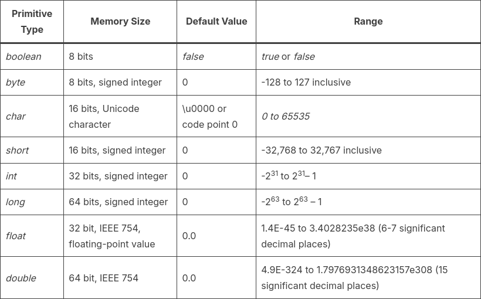

# Variables

Tal com s'ha explicat en el [Capítol 1](chapter1.md), una variable permet crear i definir dades dins del nostre algorisme, de tal manera que aquestes dades podran variar a mesura que es vagin realitzant els càlculs.

Per poder crear (**declarar**) una variable necessitem definir-ne el tipus de dades, és a dir, quines dades podrà emmagatzemar, i un nom (identificador) que ens permeti referenciar-la i utilitzar-la.
```
    tipus_dades nom_variable;
```
Un cop declarada, ja la podrem utilitzar i **assignar-li** valors.

## Tipus de dades
Els tipus de dades defineixen els valors que poden assignar a les variables i poden ser
 * tipus de dades primitius o
 * tipus de dades complexes

### Tipus de dades primitius
Són els tipus de dades més bàsiques i venen predefinides dins del llenguatge. Cada tipus primitiu ocupa un determinat nombre de bits a memòria RAM; la quantita de bits que s'utilitzen determinarà el rang de dades que pot representar.

Els tipus primitius són els següents:
* Tipus numèrics
  * Enters: permeten representar un número enter, és a dir, un número exacte, sigui positiu o sigui negatiu (-10, 4, 0, -564, 145, etc.). En Java, els tipus primitius que representen enters són els següents:
    * `byte`
    * `short`
    * `int`
    * `long`
  * Reals: permeten representar números decimals, siguin positius o siguin negatius (5.34, -0.04, -134.63, 466.351, etc.). En Java, els tipus primitius que representen reals són els següents:
    * `float`: permet representar un nombre amb, com a màxim, 6 decimals
    * `double`: permet representar un nombre amb, com a màxim, 12 decimals
  * Booleans (lògics): permeten representar la idea de *cert* o *fals* i són molt útils per crear condicions o per consultar estats. En Java només hi ha un tipus primitiu que representa un tipus lògic, el `boolean`.
  * Text: permeten representar **un únic** caràcter ('!', 'a', 'T', '4', '@', etc.). En Java, el tipus que permet representar un caràcter és el `char`.



<!-- https://howtodoinjava.com/java/basics/primitive-data-types-in-java/ -->