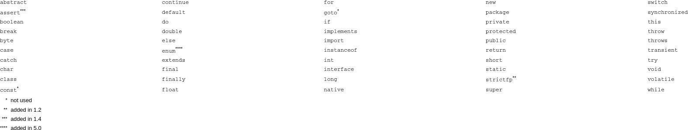

# Variables
Tal com s'ha explicat en el [Capítol 1](chapter1.md), una variable permet crear i definir dades dins del nostre algorisme, de tal manera que aquestes dades podran variar a mesura que es vagin realitzant els càlculs.

Per poder crear (**declarar**) una variable necessitem definir-ne el tipus de dades, és a dir, quines dades podrà emmagatzemar, i un nom (identificador) que ens permeti referenciar-la i utilitzar-la.
```
    tipus_dades nom_variable;
```
Un cop declarada, ja la podrem utilitzar i **assignar-li** valors.

## Tipus de dades
Els tipus de dades defineixen els valors que poden assignar a les variables i poden ser
 * tipus primitius o
 * tipus complexes

### Tipus primitius
Són els tipus de dades més bàsiques i venen predefinides dins del llenguatge. Cada tipus primitiu ocupa un determinat nombre de bits a memòria RAM; la quantita de bits que s'utilitzen determinarà el rang de dades que pot representar.

Els tipus primitius són els següents:
* Tipus numèrics
  * Enters: permeten representar un número enter, és a dir, un número exacte, sigui positiu o sigui negatiu (-10, 4, 0, -564, 145, etc.). En Java, els tipus primitius que representen enters són els següents:
    * `byte`
    * `short`
    * `int`
    * `long`
  * Reals: permeten representar números decimals, siguin positius o siguin negatius (5.34, -0.04, -134.63, 466.351, etc.). En Java, els tipus primitius que representen reals són els següents:
    * `float`: permet representar un nombre amb, com a màxim, 6 decimals
    * `double`: permet representar un nombre amb, com a màxim, 12 decimals
  * Booleans (lògics): permeten representar la idea de *cert* o *fals* i són molt útils per crear condicions o per consultar estats. En Java només hi ha un tipus primitiu que representa un tipus lògic, el `boolean`.
  * Text: permeten representar **un únic** caràcter (`'!'`, `'a'`, `'T'`, `'4'`, `'@'`, etc.). En Java, el tipus que permet representar un caràcter és el `char`.

La Figura 2.1 mostra el rang de dades que poden representar cadascun dels tipus primitius, així com també la memòria que ocupen i el valor per defecte que els assigna Java.


<!-- https://howtodoinjava.com/java/basics/primitive-data-types-in-java/ -->

### Tipus complexes
Són tipus de dades avançats que permeten representar més informació que els tipus primitius i també permeten fer operacions més complexes. Internament, però, representen la informació mitjançant els tipus primitius.

En el moment de definir una variable de tipus complex cal tenir en compte 2 factors molt importants:
1. Fa falta utilitzar un tipus complex o amb les operacions i les dades dels tipus primitius ja n'hi ha prou?
2. Ocupen molta més memòria que els tipus primitius i són més ineficients

Al llarg del llibre s'aniran descobrint molts tipus complexes, però en aquest punt s'introduïran els següents:
* Tipus numèrics
  * Enters: permeten representar un número enter, és a dir, un número exacte, sigui positiu o sigui negatiu (-10, 4, 0, -564, 145, etc.). En Java, els tipus complexes que representen enters són els següents:
    * `Byte`
    * `Short`
    * `Integer`
    * `Long`
  * Reals: permeten representar números decimals, siguin positius o siguin negatius (5.34, -0.04, -134.63, 466.351, etc.). En Java, els tipus complexes que representen reals són els següents:
    * `Float`
    * `Double`
  * Booleans (lògics): permeten representar la idea de *cert* o *fals* i són molt útils per crear condicions o per consultar estats. En Java només hi ha un tipus primitiu que representa un tipus lògic, el `Boolean`.
  * Text: permeten representar **una cadena de caràcters** (`"hola"`, `Avui fa molt bon temps"`, etc.). En Java, el tipus que permet representar una cadena de caràcters és l'`String`.

Fixeu-vos que la majoria de tipus complexes presentats tenen el mateix nom que els tipus primitius, però començant en majúscula. Més endavant aprendreu que tipus complexes també es poden coneixer amb el nom de *classes* o *objectes*.

## Normes que han de complir els identificadors (noms)
Els noms de les variables han de complir 7 normes bàsiques:
1. Els noms de les variables **han de ser únics**, és a dir, no es poden crear múltiples variables amb el mateix identificador
2. El nom de les variables ha d'estar **relacionat amb el contingut que s'hi ha de guardar**. Per exemple, per emmagatzemar l'edat d'una persona definirem la variable `int age` i no `int a` o `int b`
3. El llenguatge **Java és *case-sensitive***, és a dir, distingeix minúcules i majúscules, per tant, les variables següents són diferents:
```java
  int numstudents;
  int numStudents;
```
4. Els noms de les variables **poden contenir lletres, números i subguions (`_`)**, però mai poden contenir caràcters especials (accents, espais en blanc, lletres especials com la `ñ` o la `ç`, símbols com `!`, `)`, etc.)
5. Sempre han de **començar amb una lletra o un subguió** (main poden començar amb un número)
6. Sempre han de **començar en minúscules**; la resta del nom es pot fer utilitzant *camel-case* (posant en majúscula les primeres lletes de les diverses paraules que componen el nom) o unint les diverses paraules amb subguions, tot dependrà de l'estil propi del programador. Per exemple:
```java
  int numStudents;    //camel-case
  int num_students;   //separació amb subguions
```
7. **No es poden utilitzar les paraules reservades** del llenguatge per definir el nom de la variable. La Figura 2.2 mostra totes les paraules reservades que té Java



## Exemplificació de la declaració i ús de variables
El següent tros de codi mostra diversos exemples de creació i ús de variables
```java
  short age;                        //Declaració d'una variable per emmagatzemar l'edat d'una persona
  int num1 = 3;                     //Declaració i assignació del valor d'una variable en una sola instrucció
  int num2, num3;                   //Declaració de dos (o més) variables del mateix tipus en una sola instrucció
  float price = 10.5f, discount;    //Declaració de dos (o més) variables del mateix tipus en una sola instrucció, tot assignant el valor a alguna d'elles

  num2 = 7;                         //Assignació del valor d'una variable
  num3 = num1 + num2;               //Assignació del valor d'una variable operant altres variables
  num3 = num1 + 10;                 //Assignació del valor d'una variable operant altres variables i literals
```