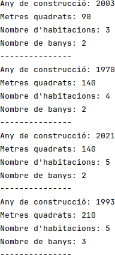
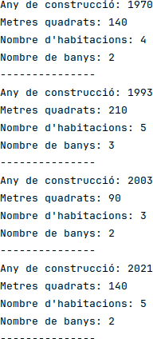

# Streams
L'*interface* `Stream` permet transformar l'objecte que la implementa en un flux de dades sobre el qual es poden aplicar (concatenar) múltiples operacions, una darrera de l'altra, per tal d'obtenir un resultat final: un càlcul, una transformació de les dades, un recorregut, etc.

Abans de saber com funcionen el objectes `Stream`, però, cal aprendre el concepte de funció o expressió *lambda*.

## Funcions *lambda*
En el [Capítol 16](chapter16.md) es va introduir el concepte global d'*interface*, la qual està formada per un conjunt de mètodes abstractes que s'han d'implementar a les classes que heretin la seva funcionalitat.

Ara però, tal com hem vist al capítol anterior ([Capítol 19](chapter19.md)), hi ha *interfaces*, com la `Serializable`, que no proporcionen cap mètode abstracte (estan completament buides) i que s'anomenen *marker inferface* perquè el seu únic objectiu és proporcionar informació addicional sobre les classes que les implementen (*marquen* les classes).

En aquest capítol introduïm les *functional inferfaces*, que són aquelles *interfaces* que només tenen un únic mètode abstracte, per exemple, la *interface* `Comparable`. Una altra *functional interface* és la *Comparator*, la quan es pot utilitzar dins del mètode `sort()` per ordenar una estructura de dades (per exemple, un `ArrayList`) els objectes de la qual no implementen la *interface* `Comparable` o, tot i implementar-la, l'ordenació dels objectes es vol fer segons algun altre criteri.

La Figura 20.1 mostra el codi de la classe `House`, la qual té atributs per emmagatzemar l'any de construcció, els metres quadrats que té, el nombre d'habitacions i el nombre de banys. A més a més, els objectes d'aquesta classe es podran comparar per metres quadrats, nombre d'habitacions i nombre de banys, en aquest ordre.


```java
public class House implements Comparable<House> {
    private int year;
    private int squareMeters;
    private int nrooms;
    private int nbathrooms;

    public House(int year, int squareMeters, int nrooms, int nbathrooms) {
        this.year = year;
        this.squareMeters = squareMeters;
        this.nrooms = nrooms;
        this.nbathrooms = nbathrooms;
    }

    @Override
    public int compareTo(House h) {
        int comp = this.squareMeters - h.squareMeters;
        if(comp == 0) {
            comp = this.nrooms - h.nrooms;
            if(comp == 0) {
                comp = this.nbathrooms - h.nbathrooms;
            }
        }
        return comp;
    }

    @Override
    public String toString() {
        return "Any de construcció: " + this.year + "\n" +
                "Metres quadrats: " + this.squareMeters + "\n" +
                "Nombre d'habitacions: " + this.nrooms + "\n" +
                "Nombre de banys: " + this.nbathrooms;
    }
}

```


La Figura 20.2 mostra el programa principal `main` ordenant un `ArrayList` d'objectes de tipus `House` utilitzant el comportament establert pel mètode `comparteTo()`. La Figura 20.3 en mostra el resultat.


```java
public class SortingMain {
    public static void main(String[] args) {
        ArrayList<House> houses = new ArrayList<>();
        houses.add(new House(1970, 140, 4, 2));
        houses.add(new House(2003, 90, 3, 2));
        houses.add(new House(1993, 210, 5, 3));
        houses.add(new House(2021, 140, 5, 2));

        houses.sort(null);

        for(int pos=0; pos<houses.size(); pos++) {
            System.out.println(houses.get(pos));
            System.out.println("---------------");
        }
    }
}
```




Pot succeir, però, que no estiguem interessats en realitzar una ordenació segons el comportament preestablert del mètode `compareTo()`, sinó que vulguem ordenar les cases segons el seu any de construcció. 

Analitzant el mètode `sort()` de la classe `ArrayList` (vegeu l'API de Java) podem veure que, per poder ordenar els elements de la llista
1. els objectes de la llista han d'implementar l'*interface* `Comparable` i, per tant, tenir el mètode `compareTo()` o
2. s'ha de definir com comparar dos objectes a través del mètode `compare` de la *interface* `Comparator`.

Així doncs, per aconseguir ordenar els objectes `House` segons el seu any de construcció, ho podem fer de dues maneres:
1. crear una classe generalista que implementi la *iterface* `Comparator` per poder comparar dos objectes `House` segons el criteri establert o
2. crear una funció *lambda* amb el comportament de comparació desitjat.

La Figura 20.4 mostra la solució al problema creant una classe que implementi la *interface* `Comparator`. En canvi, la Figura 20.5 soluciona el mateix problema creant una funció *lambda*


```java
public class HousingComparator implements Comparator<House> {
    @Override
    public int compare(House o1, House o2) {
        return o1.getYear() - o2.getYear();
    }
}

public class SortingMain {
    public static void main(String[] args) {
        ArrayList<House> houses = new ArrayList<>();
        houses.add(new House(1970, 140, 4, 2));
        houses.add(new House(2003, 90, 3, 2));
        houses.add(new House(1993, 210, 5, 3));
        houses.add(new House(2021, 140, 5, 2));

        HousingComparator comparator = new HousingComparator();
        houses.sort(comparator);

        for(int pos=0; pos<houses.size(); pos++) {
            System.out.println(houses.get(pos));
            System.out.println("---------------");
        }
    }
}
```



**Important:** per tal que el codi de la Figura 20.4 funcioni correctament s'ha hagut d'afegir el *getter* de l'atribut `year` a la classe `House`.


La solució que proposa la Figura 20.4, tot i ser correcta, pot arribar a ser farragosa perquè, molts cops, el `Comparator` que es crea només s'utilitza una única vegada. En aquests casos és preferible crear una funció *lambda*, tal com mostra la Figura 20.5, la qual només es podrà utilitzar un únic cop.


```java
public class SortingMain {
    public static void main(String[] args) {
        ArrayList<House> houses = new ArrayList<>();
        houses.add(new House(1970, 140, 4, 2));
        houses.add(new House(2003, 90, 3, 2));
        houses.add(new House(1993, 210, 5, 3));
        houses.add(new House(2021, 140, 5, 2));

        houses.sort(
                (House o1, House o2) -> {
                    return o1.getYear() - o2.getYear();
                }
        );

        for(int pos=0; pos<houses.size(); pos++) {
            System.out.println(houses.get(pos));
            System.out.println("---------------");
        }
    }
}
```


El codi de les Figures 20.4 i 20.5 generen el mateix resultat, mostrat a la Figura 20.6.



### Què és una funció *lambda*
Una funció *lambda* (o anònima) és una funció que no té nom i que, per tant, no pot ser invocada més enllà d'on se'n fa la declaració. És a dir, una funció *lamda* es declara i s'invoca en el mateix punt del codi i no es pot reutilitzar. 

L'ús principal que se'n fa és per implementar les *functional interfaces* i la seva estructura consisteix en una zona de parèntesis per fer la declaració de paràmetres, una fletxa `->` i un bloc de codi per implementar-ne el comportament:
```java
    (Type1 param1, Type2 param2) -> {Code}
```