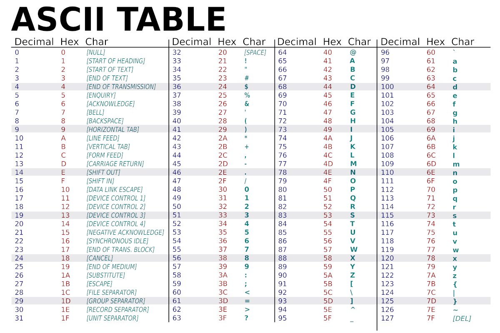
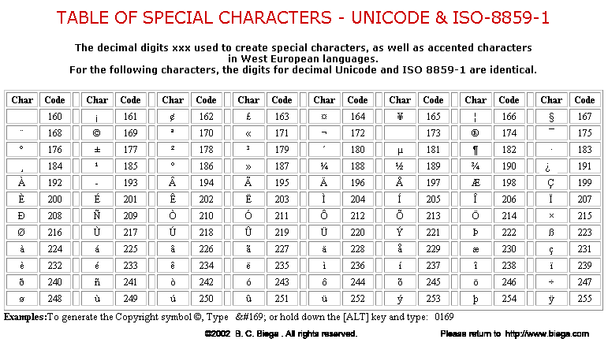

# Cadenes de caràcters: la classe `String`
El llenguatge Java ofereix la classe `String` per poder crear, manipular i tractar cadenes de caràcters. Aquestes cadenes poden estar formades per un únic caràcter *Unicode*, per una paraula, per una frase o per un tros de text fins i tot més llarg.

Per poder analitzar tota la informació i les operacions que es poden amb els `String` s'ha de consultar l'[API de Java](https://docs.oracle.com/en/java/javase/23/docs/api/java.base/java/lang/String.html).

## Declarar i inicialitzar variables i constants de tipus `String`
La declaració i inicialització de variables i constants de tipus `String` es pot fer de múltiples maneres, sigui a partir de literals o a partir d'altres variables i constants.
```java
    String name1;                               //Declaració de la variable name1 de tipus String;
    String name2 = new String("M.Àngels");      /*Declaració i inicialització de la variable name2, de tipus String,
                                                    de la manera clàssica, utilitzant el constructor (no s'acostuma a fer servir)*/
    String name3 = "M.Àngels";                  /*Declaració i inicialització de la variable name3 amb
                                                    assignació directa de valor mitjançant un literal*/
    String name4 = name3;                       /*Declaració i inicialització de la variable name4 amb
                                                    assignació directa de valor mitjançant una altra variable*/
    String name5 = name4 + " Cerveró Abelló";   /*Declaració i inicialització de la variable name5 amb
                                                    assignació directa de valor mitjançant la concatenació
                                                    d'una variable i un literal*/
    final String COURSE1 = new String("DAM 1"); /*Declaració i inicialització de la constant COURSE1 de la manera clàssica,
                                                    utilitzant el constructor (no s'acostuma a fer servir)*/
    final String COURSE2 = "DAM 1";             /*Declaració i inicialització de la constant COURSE2 amb
                                                    assignació de valor mitjançant un literal*/
    final String COURSE3 = COURSE2;             /*Declaració i inicialització de la constant COURSE3 amb
                                                    assignació de valor mitjançant una altra constant*/
    final String COURSE4 = name3;               /*Declaració i inicialització de la constant COURSE4 amb
                                                    assignació de valor mitjançant una variable*/
```

## Comparació d'`String`
Per comparar dues variables o constants d'`String` no es poden utilitzar els operadors lògics d'igualtat (`==`, `<=`, `>=`) ni de diferència (`!=`, `<`, `>`), sinó que s'han d'utilitzar els mètodes de comparació que ofereix la classe `String`.

### Mètode `equals()`
El mètode [`equals()`](https://docs.oracle.com/en/java/javase/23/docs/api/java.base/java/lang/String.html#equals(java.lang.Object)) permet comparar per igualtat dues cadenes de caràcters.
```java
    boolean equals(Object obj);
```
Si les dues cadenes són idèntiques (mateixos caràcters, tenint en compte majúscules i minúscules) retorna `true`; si no, retorna `false` (encara que la diferència sigui d'un únic caràcter). Per poder comparar les dues variables (o constants) de tipus `String` `str1` i `str2` s'ha de fer de la manera següent: `str1.equals(str2)`. Per exemple:
```java
    str1.equals(str2);
    str2.equals(str1);

    /*Les dues sentències són equivalents; no importa quina variable
        s'utilitza primer, str1 o str2, ja que el resultat és el mateix*/
```

El codi següent mostra com s'utilitza el mètode:
```java
    String name1 = "M.Àngels";
    String name2 = "M.ÀNGELS";
    String name3 = "M.Àngels";
    String course1 = "\tDAM 1";
    String course2 = "DAM 1\n";
    String course3 = "\tDAM 1";
    String str1 = "Bon dia!";
    String str2 = "Bon dia, com esteu?";
    boolean areEquals;

    areEquals = name1.equals(name2);        /*Retornarà false
                                                (problema de majúscules minúscules)*/
    areEquals = name1.equals(name3);        //Retornarà true
    areEquals = course1.equals(course2);    //Retornarà false
    areEquals = course1.equals(course3);    //Retornarà true
    areEquals = str1.equals(str2);          //Retornarà false
```

### Mètode `equalsIgnoreCase()`
El mètode [`equalsIgnoreCase()`](https://docs.oracle.com/en/java/javase/23/docs/api/java.base/java/lang/String.html#equalsIgnoreCase(java.lang.String)) també permet comparar per igualtat dues cadenes de caràcters.
```java
    boolean equalsIgnoreCase(String str);
```
S'utilitza igual que el mètode `equals()`, és a dir, per poder comparar les dues variables (o constants) de tipus `String` `str1` i `str2` s'ha de fer de la manera següent: `str1.equalsIgnoreCase(str2)`;
```java
    str1.equalsIgnoreCase(str2);
    str2.equalsIgnoreCase(str1);

    /*Les dues sentències són equivalents; no importa quina variable
        s'utilitza primer, str1 o str2, ja que el resultat és el mateix*/
```
Ara però, al contrari que el mètode `equals()`, l'`equalsIgnoreCase()` no té en compte les majúscules i minúscules. Per exemple:
El codi següent mostra com s'utilitza el mètode:
```java
    String name1 = "M.Àngels";
    String name2 = "M.ÀNGELS";
    String name3 = "M.Àngels";
    String course1 = "\tDAM 1";
    String course2 = "DAM 1\n";
    String course3 = "\tDAM 1";
    String course4 = "\tdam 1";
    String str1 = "Bon dia!";
    String str2 = "Bon dia, com esteu?";
    boolean areEquals;

    areEquals = name1.equals(name2);        /*Retornarà true
                                                (ignora majúscules i minúscules)*/
    areEquals = name1.equals(name3);        //Retornarà true
    areEquals = course1.equals(course2);    //Retornarà false
    areEquals = course1.equals(course3);    //Retornarà true
    areEquals = course1.equals(course4);    //Retornarà true
    areEquals = str1.equals(str2);          //Retornarà false
```

### Mètode `regionMatches()`
El mètode `regionMatches()` permet comparar per igualtat fragments de dues cadenes de caràcters (no fa falta comparar les cadenes de principi a final). Aquest mètode té dues *sobrecàrregues*, segons si es vol comparar els fragments tenint en compte les majúscules i minúscules o no:
* [`reginMatches()` sobrecàrrega 1](https://docs.oracle.com/en/java/javase/23/docs/api/java.base/java/lang/String.html#regionMatches(int,java.lang.String,int,int))
* [`reginMatches()` sobrecàrrega 2](https://docs.oracle.com/en/java/javase/23/docs/api/java.base/java/lang/String.html#regionMatches(boolean,int,java.lang.String,int,int))
```java
    boolean regionMatches(int toffset, String str, int ooffset, int length);                        //Case-sensitive
    boolean regionMatches(boolean ignoreCase, int toffset, String str, int ooffset, int length);
```
Per poder comparar fragments de dues variables (o constants) de tipus `String` `str1` i `str2` s'ha de fer de la manera següent: `str1.regionMatches(parameters)`.

Explicació dels paràmetres:
* `toffset`: posició de la cadena `str1` on comença el fragment que volem comparar
* `ooffset`: posició de la cadena `str2` on comença el fragment que volem comparar
* `length`: llargada del segment que volem comparar (número de caràcters que té el fragment)
* `ignoreCase`: indica si volem que el mètode tingui en compte majúscules i minúscules (`true`) o no (`false`)

El codi següent mostra com s'utilitzen el dos mètodes:
```java
    String name1 = "M.Àngels";
    String name2 = "M.ÀNGELS";
    String course1 = "\tDAM 1";
    String course2 = "DAM 1\n";
    String course3 = "\tdam 1";
    String str1 = "El meu gos és negre";
    String str2 = "Loki, el meu gos";
    boolean areEquals;

    areEquals = name1.equals(0, name2, 0, 3);               //Retornarà true
    areEquals = name1.equals(0, name2, 0, 5);               //Retornarà false
    areEquals = course1.equals(1, course2, 0, 5);           //Retornarà true
    areEquals = course1.equals(false, 0, course3, 0, 5);    //Retornarà true
    areEquals = course1.equals(true, 0, course3, 0, 5);     //Retornarà false
    areEquals = course1.equals(0, course3, 0, 5);           //Retornarà false
    areEquals = str1.equals(7, str2, 13, 3);                //Retornarà true
```

### Mètode `compareTo()`
El mètode [`compareTo()`](https://docs.oracle.com/en/java/javase/23/docs/api/java.base/java/lang/String.html#compareTo(java.lang.String)) compararà dues cadenes de caràcters (`String`) de manera alfabètica, és a dir, tenint en compte l'ordre que ocupen les lletres i caràcters dins de l'alfabet (o dins de la distribució *Unicode*).
```java
    int compareTo(String str);
```
Per comparar dues variables (o constants) de tipus `String` `str1` i `str2` s'ha de fer de la manera següent: `str1.compareTo(str2)`:
```java
    str1.compareTo(str2);
    str2.compareTo(str1);

    /*Les dues sentències són equivalents; no importa quina variable
        s'utilitza primer, str1 o str2, ja que el resultat és el mateix*/
```
i el mètode retornarà:
* 0 si `str1` i `str2` són exactament iguals (majúscules i minúscules incloses);
* un valor negatiu si `str1` és menor que `str2`, on `str1` és la variable que invoca el mètode de comparació i `str2` és la variable que es passa per paràmetre;
* un valor positiu si `str1` és major que `str2`.

Per saber si una cadena de caràcters és menor o major que una altra, el mètode `compareTo()` les analitza totes dues fins que troba el prier caràcter diferent. Un cop trobat, la cadena més petita serà la que tingui el caràcter que aparegui abans a l'alfabet. En cas que no hi hagi cap caràcter diferent, la cadena més petita és la que és més curta. Per exemple:
* *ord**e**nar* és més petita que *ord**i**nador* perquè la **e**, que és el primer caràcter diferent, va abans que la **i** dins l'alfabet.
* *ordena* és més petit que *ordenar* perquè és més curta (*ordena* té 6 caràcters, o lletres, i, en canvi, *ordenar* en té 7).

El codi següent mostra com s'utilitza el mètode (consulteu la Taula ASCII de la Figura 8.1):
```java
    String name1 = "M.Àngels";
    String name2 = "M.ÀNGELS";
    String course1 = "\tDAM 1";
    String course2 = "DAM 1\n";
    String course3 = "\tDAM 1";
    String str1 = "Bon dia";
    String str2 = "Bon dia Joan";
    int areEquals;

    areEquals = name1.compareTo(name2);        /*Retornarà un valor positiu
                                                (les minúscules van després de les majúscules a la taula ASCII )*/
    areEquals = course1.compareTo(course2);    /*Retornarà un valor negatiu
                                                (el símbol del tabulador va abans de les lletres a la taula ASCII)*/
    areEquals = course1.compareTo(course3);    //Retornarà 0
    areEquals = str1.compareTo(str2);          /*Retornarà un valor negatiu
                                                (str1 és més curta que str2)*/
```



### Mètode `compareToIgnoreCase()`
El mètode [`compareToIgnoreCase()`](https://docs.oracle.com/en/java/javase/23/docs/api/java.base/java/lang/String.html#compareToIgnoreCase(java.lang.String)) funciona exactament igual que el mètode `compareTo()` però essent *non case-sensitive`, és a dir, per avaluar dos cadenes de caràcters no diferencia majúscules i minúscules.
```java
    int compareToIgnoreCase(String str);
```
S'utilitza igual que el mètode `compareTo()`, és a dir, per poder comparar les dues variables (o constants) de tipus `String` `str1` i `str2` s'ha de fer de la manera següent: `str1.compareToIgnoreCase(str2)`;
```java
    str1.compareToIgnoreCase(str2);
    str2.compareToIgnoreCase(str1);

    /*Les dues sentències són equivalents; no importa quina variable
        s'utilitza primer, str1 o str2, ja que el resultat és el mateix*/
```

El codi següent mostra com s'utilitza el mètode:
```java
    String name1 = "M.Àngels";
    String name2 = "M.ÀNGELS";
    String course1 = "\tDAM 1";
    String course2 = "DAM 1\n";
    String course3 = "\tDam 1";
    String str1 = "Bon dia";
    String str2 = "Bon dia Joan";
    int areEquals;

    areEquals = name1.compareTo(name2);        //Retornarà 0
    areEquals = course1.compareTo(course2);    /*Retornarà un valor negatiu
                                                (el símbol del tabulador va abans de les lletres a la taula ASCII)*/
    areEquals = course1.compareTo(course3);    //Retornarà 0
    areEquals = str1.compareTo(str2);          /*Retornarà un valor negatiu
                                                (str1 és més curta que str2)*/
```

## Obtenció de la longitud d'un `String`
Per saber la longitud (el nombre de caràcters) que té un `String` s'utilitza el mètode [`length()`](https://docs.oracle.com/en/java/javase/23/docs/api/java.base/java/lang/String.html#length()).
```java
    int length();
```
Per poder saber la longitud d'una variable (o constant) de tipus `String str` el mètode `length()`s'ha d'utilitzar de la manera següent:
```java
    str.length();
```

El codi següent mostra com s'utilitza el mètode:
```java
    String name = "M.Àngels";
    String str1 = " ";
    String str2 = "";
    String course = "\tDAM 1";
    int len;

    len = name.length();        //Retornarà 8
    len = str1.length();        //Retornarà 1
    len = str2.length();        //Retornarà 0
    len = course.length();      //Retornarà 6
```

## Obtenció de caràcters d'un `String`
Donada una variable (o constant) de tipus `String`, se'n pot consultar els caràcters individualment, segons la posició que ocupen, o obtenir-ne una subcadena, és a dir, un fragment, que comenci i acabi on es desitgi.

### Mètode `charAt()`
El mètode [`charAt()`](https://docs.oracle.com/en/java/javase/23/docs/api/java.base/java/lang/String.html#charAt(int)) permet obtenir el caràcter que hi ha en una posició concreta.
```java
    char charAt(int pos);
```
Si el valor del paràmetre `pos` és correcte, és a dir, és major o igual que 0 i menor que la longitud de la cadena que estem consultant, el mètode retorna el caràcter (`char`) que hi ha en aquella posició. En cas contrari llença l'excepció `IndexOutOfBoundsException` i el programa s'atura (provoca un error). Per poder obtenir el caràcter a la posició *X* d'una variable (o constant) de tipus `String str` s'ha de fer de la manera següent:
```java
    int pos = 0;
    str.equals(pos);
```

El codi següent mostra com s'utilitza el mètode:
```java
    String name = "M.Àngels";
    String course = "\tDAM 1";
    String str1 = "Bon dia!";
    char character;
    int pos = 0;

    character = name.charAt(2);         //Retornarà 'À'
    character = course.charAt(pos);     //Retornarà '\t'
    character = str.equals(3);          //Retornarà ' '
    character = str.equals(7);          //Retornarà '!'
    character = str.equals(8);          //Error!
```

### Mètode `codePointAt()`
El mètode [`codePointAt()`](https://docs.oracle.com/en/java/javase/23/docs/api/java.base/java/lang/String.html#codePointAt(int)) funciona exactament igual que el mètode `charAt()` però, en comptes de retornar el caràcter que hi ha en una posició concreta en format `char`, retorna el codi ASCII d'aquest caràcter, és a dir, un `int`.
```java
    int codePointAt(int pos);
```
Si el valor del paràmetre `pos` és correcte, és a dir, és major o igual que 0 i menor que la longitud de la cadena que estem consultant, el mètode retorna el codi ASCII del caràcter (`int`) que hi ha en aquella posició. En cas contrari llença l'excepció `IndexOutOfBoundsException` i el programa s'atura (provoca un error). Per poder obtenir el codi ASCII caràcter a la posició *X* d'una variable (o constant) de tipus `String str` s'ha de fer de la manera següent:
```java
    int pos = 0;
    str.codePointAt(pos);
```

El codi següent mostra com s'utilitza el mètode (consulteu la Taula ASCII de la Figura 8.1 i els caràcters de la Taula UNICODE parcial de la Figura 8.2):
```java
    String name = "M.Àngels";
    String course = "\tDAM 1";
    String str1 = "Bon dia!";
    char character;
    int pos = 0;

    character = name.charAt(2);         //Retornarà 192
    character = course.charAt(pos);     //Retornarà 9
    character = str.equals(3);          //Retornarà 32
    character = str.equals(7);          //Retornarà 33
    character = str.equals(8);          //Error!
```


### Mètode `substring()`
El mètode `substring()` permet obtenir una subcadena (un fragment) de la cadena de caràcters que s'estigui avaluant. Aquest mètode té dues *sobrecàrregues*:
* [`substring()` sobrecàrrega 1](https://docs.oracle.com/en/java/javase/23/docs/api/java.base/java/lang/String.html#substring(int))
* [`substring()` sobrecàrrega 2](https://docs.oracle.com/en/java/javase/23/docs/api/java.base/java/lang/String.html#substring(int,int))
```java
    String substring(int iniPos);
    String substring(int iniPos, int endPos);
```
Per poder obtenir una subcadena d'una variable (o constant) de tipus `String str` s'ha de fer de la manera següent: `str.substring(parameters)`.

Explicació dels paràmetres:
* `iniPos`: posició de la cadena `str` on comença el fragment que volem obtenir
* `endPos`: posició de la cadena `str` on acaba el fragment que volem obtenir

En la primera sobrecàrrega del mètode (`String substring(int iniPos)`), com que no s'indica la posició final, el fragment que s'obtè va des de la posició inicial indicada fins al final de la cadena `str`. En canvi, en la segona sobrecàrrega (`String substring(int iniPos, int endPos)`) el fragment va des de la posició inicial fins a la posició final -1 (la posició final és excloent).

Cal tenir en compte que si qualsevol dels paràmetres és incorrecte, és a dir, les posicions indicades són negatives o superiors a la llargada de la cadena original o la posició inicial és més gran que la final, els mètodes llençaran l'excepció `IndexOutOfBoundsException`.

El codi següent mostra com s'utilitzen el dos mètodes:
```java
    String name = "M.Àngels";
    String str1 = "El meu gos és negre";
    String str2 = "Loki, el meu gos";
    String fragment;
    int iniPos = 0, endPos = 4;

    fragment = name.substring(2);                       //Retornarà "Àngels"
    fragment = name.substring(-2);                      //Error!
    fragment = str1.equals(iniPos, 10);                 //Retornarà "El meu gos"
    fragment = str2.substring(iniPos, endPos);          //Retornarà "Loki"
    fragment = str2.substring(endPos, iniPos);          //Error!
    fragment = str2.substring(0, str.length() + 10);    //Error!
```

## Cerca dins d'un `String`
Donada una variable (o constant) de tipus `String`, es poden cercar subcadenes i saber si s'han trobat i, fins i tot, en quina posició s'han trobat.

### Mètode `indexOf()`
El mètode `indexOf()` permet obtenir la posició on apareix, per primer cop, un caràcter o una subcadena (un fragment) dins de la cadena de caràcters principal. Aquest mètode té sis *sobrecàrregues*:
* [`indexOf()` sobrecàrrega 1](https://docs.oracle.com/en/java/javase/23/docs/api/java.base/java/lang/String.html#indexOf(int))
* [`indexOf()` sobrecàrrega 2](https://docs.oracle.com/en/java/javase/23/docs/api/java.base/java/lang/String.html#indexOf(int,int))
* [`indexOf()` sobrecàrrega 3](https://docs.oracle.com/en/java/javase/23/docs/api/java.base/java/lang/String.html#indexOf(int,int,int))
* [`indexOf()` sobrecàrrega 4](https://docs.oracle.com/en/java/javase/23/docs/api/java.base/java/lang/String.html#indexOf(java.lang.String))
* [`indexOf()` sobrecàrrega 5](https://docs.oracle.com/en/java/javase/23/docs/api/java.base/java/lang/String.html#indexOf(java.lang.String,int))
* [`indexOf()` sobrecàrrega 6](https://docs.oracle.com/en/java/javase/23/docs/api/java.base/java/lang/String.html#indexOf(java.lang.String,int,int))
```java
    int indexOf(int ch);
    int indexOf(int ch, int iniPos);
    int indexOf(int ch, int iniPos, int endPos);
    int indexOf(String sbstr);
    int indexOf(String sbstr, int iniPos);
    int indexOf(String sbstr, int iniPos, int endPos);
```
Per poder obtenir la primera posició d'un caràcter o d'una subcadena dins de la cadena de caràcters principal `String str` s'ha de fer de la manera següent: `str.indexOf(parameters)`.

Explicació dels paràmetres:
* `ch`: caràcter que es vol buscar (recordeu que cada caràcter `char` té la seva representació directa en format numèric `int`)
* `sbstr`: subcadena que es vol buscar
* `iniPos`: posició de la cadena principal `str` a partir de la qual volem començar a buscar el caràcter `ch` o la subcadena `sbstr`
* `endPos`: posició de la cadena principal `str` a partir de la qual volem aturar la cerca del caràcter `ch` o de la subcadena `sbstr` (no buscarem més enllà de la posició `endPos`)

Explicació del retorn: qualsevol d'aquestes sobrecàrregues retorna la posició de la cadena principal `str` on s'ha trobat, per primera vegada, el caràcter `ch` o la subcadena `sbstr` que s'està buscant. En cas que no s'hagi trobat, retorna `-1`.
Cal tenir en compte que la primera posició sempre és la `0`.

En les sobrecàrregues del mètode `int indexOf(int ch)` i `int indexOf(String sbstr)`, com que no s'indica ni la posició d'inici ni la de finalització, el caràcter o el fragment es busca des del principi fins al final de la cadena principal `str`. En les sobrecàrregues `int indexOf(int ch, int iniPos)` i `int indexOf(String sbstr, int iniPos)`, el caràcter o el fragment es cerca des de la posició `iniPos` fins al final de la cadena principal `str`. Finalment, en les sobrecàrregues `int indexOf(int ch, int iniPos, int endPos)` i `int indexOf(String sbstr, int iniPos, int endPos)`, el caràcter o el fragment es busca des de la posició `iniPos` fins a la posició `endPos - 1` (excloent!) de la cadena principal `str`.

Cal tenir en compte que si qualsevol dels paràmetres de posició (`iniPos` o `endPos`) és incorrecte, és a dir, les posicions indicades són negatives o superiors a la llargada de la cadena principal o la posició inicial és més gran que la final, els mètodes llençaran l'excepció `StringIndexOutOfBoundsException`.

El codi següent mostra com s'utilitzen el dos mètodes:
```java
    String str = "El meu gos es diu Loki i és negre";
    int pos;

    pos = str.indexOf('m');                         //Retornarà 3
    pos = str.indexOf('ç');                         //Retornarà -1
    pos = str.indexOf(' ', 8);                      //Retornarà 10
    pos = str.indexOf('e', 15, 30);                 //Retornarà 29
    pos = str.indexOf("Loki");                      //Retornarà 18
    pos = str.indexOf("el");                        //Retornarà -1
    pos = str.indexOf("El");                        //Retornarà 0
    pos = str.indexOf("gos", 15);                   //Retornarà -1
    pos = str.indexOf("diu", 10);                   //Retornarà 14
    pos = str.indexOf("gre", 10, 15);               //Retornarà -1
    pos = str.indexOf("és", 10, 30);                //Retornarà 25
    pos = str.indexOf("gos", -10);                  //Error!
    pos = str.indexOf("gos", 5, 100);               //Error!
    pos = str.indexOf("gos", 30, 10);               //Error!
```

### Mètode `lastIndexOf()`
El mètode `lastIndexOf()` és molt similar al mètode `indexOf()`, de tal manera que, en comptes d'obtenir primera la posició on apareix un caràcter o una subcadena (un fragment) dins de la cadena de caràcters principal, obté la posició on apareix per darrer cop. Té quatre *sobrecàrregues*:
* [`lastIndexOf()` sobrecàrrega 1](https://docs.oracle.com/en/java/javase/23/docs/api/java.base/java/lang/String.html#lastIndexOf(int))
* [`lastIndexOf()` sobrecàrrega 2](https://docs.oracle.com/en/java/javase/23/docs/api/java.base/java/lang/String.html#lastIndexOf(int,int))
* [`lastIndexOf()` sobrecàrrega 3](https://docs.oracle.com/en/java/javase/23/docs/api/java.base/java/lang/String.html#lastIndexOf(java.lang.String))
* [`lastIndexOf()` sobrecàrrega 4](https://docs.oracle.com/en/java/javase/23/docs/api/java.base/java/lang/String.html#lastIndexOf(java.lang.String,int))
```java
    int lastIndexOf(int ch);
    int lastIndexOf(int ch, int iniPos);
    int lastIndexOf(String sbstr);
    int lastIndexOf(String sbstr, int iniPos);
```
Per poder obtenir la darrera posició d'un caràcter o d'una subcadena dins de la cadena de caràcters principal `String str` s'ha de fer de la manera següent: `str.lastIndexOf(parameters)`.

Explicació dels paràmetres:
* `ch`: caràcter que es vol buscar (recordeu que cada caràcter `char` té la seva representació directa en format numèric `int`)
* `sbstr`: subcadena que es vol buscar
* `iniPos`: posició de la cadena principal `str` a partir de la qual volem començar a buscar el caràcter `ch` o la subcadena `sbstr` (cal tenir en compte que la cerca és a l'inversa, des d'`iniPos` fins a l'inici de la cadena principal!)

Explicació del retorn: qualsevol d'aquestes sobrecàrregues retorna la posició de la cadena principal `str` on s'ha trobat, per darrera vegada, el caràcter `ch` o la subcadena `sbstr` que s'està buscant. En cas que no s'hagi trobat, retorna `-1`.
Cal tenir en compte que la primera posició sempre és la `0`.

En les sobrecàrregues del mètode `int lastIndexOf(int ch)` i `int lastIndexOf(String sbstr)`, com que no s'indica la posició d'inici de la cerca, el caràcter o el fragment es busca des del final fins al principi de la cadena principal `str`. En les sobrecàrregues `int lastIndexOf(int ch, int iniPos)` i `int lastIndexOf(String sbstr, int iniPos)`, el caràcter o el fragment es cerca des de la posició `iniPos` fins al principi de la cadena principal `str`.

El codi següent mostra com s'utilitzen el dos mètodes:
```java
    String str = "El meu gos es diu Loki i és negre";
    int pos;

    pos = str.lastIndexOf('m');                         //Retornarà 3
    pos = str.lastIndexOf('ç');                         //Retornarà -1
    pos = str.lastIndexOf(' ', 8);                      //Retornarà 6
    pos = str.lastIndexOf('e', 30);                     //Retornarà 29
    pos = str.lastIndexOf('e', 3);                      //Retornarà -1
    pos = str.lastIndexOf("Loki");                      //Retornarà 18
    pos = str.lastIndexOf("el");                        //Retornarà -1
    pos = str.lastIndexOf("El");                        //Retornarà 0
    pos = str.lastIndexOf("gos", 15);                   //Retornarà 7
    pos = str.lastIndexOf("diu", 10);                   //Retornarà -1
```

## Comprovacions sobre un `String`
Donada una variable (o constant) de tipus `String`, es poden realitzar diverses comprovacions sobre la seva composició, com per exemple, si és una cadena buida o si comença o acaba amb una determinada subcadena.

### Mètode `isBlank()`
El mètode [`isBlank()`](https://docs.oracle.com/en/java/javase/23/docs/api/java.base/java/lang/String.html#isBlank()) comprova si la cadena de caràcters està buida o només conté *espais en blanc*, entenent com a espais en blanc tots els llistats en aquest [enllaç](https://docs.oracle.com/en/java/javase/23/docs/api/java.base/java/lang/Character.html#isWhitespace(int)); en el cas que ens ocupa, comprova si la cadena de caracters està buida o si només conté espais (`' '`), tabuladors (`'\t'`) i salts de línia (`'\n'`).
```java
    boolean isBlank();
```
En cas que la cadena que estem consultant sigui buida o només contingui espais, el mètode retorna `true`; en cas contrari, retorna `false`. Per poder utilitzar aquest mètode sobre una variable (o constant) de tipus `String str` s'ha de fer de la manera següent: `str.isBlank()`

El codi següent mostra com s'utilitza el mètode:
```java
    String str1 = "M.Àngels";
    String str2 = "\t";
    String str3 = "        ";
    String str4 = "\n";
    String str5 = "\t\t\n   \t";
    String str6 = "\t\t\n  a \t";
    boolean isBlankString;

    isBlankString = str1.isBlank();     //Retornarà false
    isBlankString = str2.isBlank();     //Retornarà true
    isBlankString = str3.isBlank();     //Retornarà true
    isBlankString = str4.isBlank();     //Retornarà true
    isBlankString = str5.isBlank();     //Retornarà true
    isBlankString = str6.isBlank();     //Retornarà false
```

### Mètode `isEmpty()`
El mètode [`isEmpty()`](https://docs.oracle.com/en/java/javase/23/docs/api/java.base/java/lang/String.html#isEmpty()) comprova si la cadena de caràcters està completament buida, és a dir, si la seva longitud és 0.
```java
    boolean isEmpty();
```
En cas que la cadena que estem consultant sigui buida, el mètode retorna `true`; en cas contrari, retorna `false`. Per poder utilitzar aquest mètode sobre una variable (o constant) de tipus `String str` s'ha de fer de la manera següent: `str.isEmpty()`

El codi següent mostra com s'utilitza el mètode:
```java
    String str1 = "M.Àngels";
    String str2 = "\t";
    String str3 = "        ";
    String str4 = "\n";
    String str5 = "\t\t\n   \t";
    String str6 = "\t\t\n  a \t";
    String str7 = "";
    boolean isEmptyString;

    isEmptyString = str1.isEmpty();     //Retornarà false
    isEmptyString = str2.isEmpty();     //Retornarà false
    isEmptyString = str3.isEmpty();     //Retornarà false
    isEmptyString = str4.isEmpty();     //Retornarà false
    isEmptyString = str5.isEmpty();     //Retornarà false
    isEmptyString = str6.isEmpty();     //Retornarà false
    isEmptyString = str7.isEmpty();     //Retornarà true
```

### Mètode `contains()`
El mètode [`contains()`](https://docs.oracle.com/en/java/javase/23/docs/api/java.base/java/lang/String.html#contains(java.lang.CharSequence)) comprova si la cadena de caràcters que s'està analitzant conté una subcadena en concret.
```java
    boolean contains(CharSequence seq);
```
En cas que la cadena que estem consultant contingui la subcadena, el mètode retorna `true`; en cas contrari, retorna `false`. Cal tenir en compte, però, que el mètode és *case-sensitive* i, per tant, té en compte les majúscules i les minúscules.

Per poder utilitzar aquest mètode sobre una variable (o constant) de tipus `String str` i saber si la subcadena `CharSequence seq` hi està continguda o no s'ha de fer de la manera següent: `str.contains(seq)`

Explicació dels paràmetres:
* `seq`: subcadena de caràcters que es vol buscar dins de la cadena principal `str`. Aquesta subcadena és de tipus `CharSequence`, però a efectes pràctics acaba essent un `String`.

El codi següent mostra com s'utilitza el mètode:
```java
    String str1 = "El meu gos es diu Loki i és negre";
    String str2 = "GOS";
    String str3 = "Loki";
    boolean inside;

    inside = str1.contains(str2);       //Retornarà false
    inside = str1.contains(str3);       //Retornarà true
    inside = str1.contains("@");        //Retornarà false
    inside = str1.contains("oki i és"); //Retornarà true
```

### Mètode `startsWith()`
El mètode `startsWith()` permet saber si una cadena de caràcters comença, o no, amb una subcadena (un fragment) determinat. Aquest mètode té dues *sobrecàrregues*:
* [`startsWith()` sobrecàrrega 1](https://docs.oracle.com/en/java/javase/23/docs/api/java.base/java/lang/String.html#startsWith(java.lang.String))
* [`startsWith()` sobrecàrrega 2](https://docs.oracle.com/en/java/javase/23/docs/api/java.base/java/lang/String.html#startsWith(java.lang.String,int))
```java
    boolean startsWith(String sbstr);
    boolean startsWith(String sbstr, int iniPos);
```
Per poder saber si una variable (o constant) de tipus `String str` comença amb una subcadena determinada s'ha de fer de la manera següent: `str.startsWith(parameters)`. Cal tenir en compte, a més a més, que el mètode és *case-sensitive* i, per tant, té en compte majúscules i minúscules.

Explicació dels paràmetres:
* `sbstr`: la subcadena que volem comprovar si es troba, o no, a l'inici de la cadena de caràcters principal `str` 
* `iniPos`: posició de la cadena `str` on volem comprocar si comença el fragment `sbstr`

La primera sobrecàrrega del mètode (`boolean startsWith(String sbstr)`), com que no indica la posició inicial, només retornarà `true` si el fragment `sbstr` es troba a l'inici de la cadena principal `str`. En canvi, la segona sobrecàrrega (`boolean startsWith(String sbstr, int iniPos)`) només retornarà `true` si el fragment `sbstr` es troba a la posició `iniPos` de la cadena principal.

El codi següent mostra com s'utilitzen el dos mètodes:
```java
    String str1 = "El meu gos es diu Loki i és negre";
    String str2 = "El";
    String str3 = "el";
    boolean isStarting;
    int iniPos;

    isStarting = str1.startsWidth(str2);                    //Retornarà true
    isStarting = str1.startsWidth(str3);                    //Retornarà false (el mètode és case-sensitive)
    isStarting = str1.startsWidth("Loki", 18);              //Retornarà true
    isStarting = str1.startsWidth("loki", 18);              //Retornarà false (el mètode és case-sensitive)
    isStarting = str1.startsWidth("Loki", -1);              //Retornarà false (posició fora de rang)
    isStarting = str1.startsWidth("Loki", 100);             //Retornarà false (posició fora de rang)
    isStarting = str1.startsWidth("i", 15);                 //Retornarà true
    isStarting = str1.startsWidth("os es di", 8);           //Retornarà true
```

### Mètode `endsWith()`
El mètode [`endsWith()`](https://docs.oracle.com/en/java/javase/23/docs/api/java.base/java/lang/String.html#endsWith(java.lang.String)) permet saber si una cadena de caràcters acaba, o no, amb una subcadena (un fragment) determinat
```java
    boolean endsWith(String sbstr);
```
Per poder saber si una variable (o constant) de tipus `String str` acaba amb una subcadena `String sbstr` determinada s'ha de fer de la manera següent: `str.endsWith(sbstr)`. Cal tenir en compte, a més a més, que el mètode és *case-sensitive* i, per tant, té en compte majúscules i minúscules.

Explicació dels paràmetres:
* `sbstr`: la subcadena que volem comprovar si es troba, o no, a al final de la cadena de caràcters principal `str` 

El codi següent mostra com s'utilitza el mètode:
```java
    String str1 = "El meu gos es diu Loki i és negre";
    String str2 = "negre";
    String str3 = "neGre";
    boolean isEnding;

    isEnding = str1.endsWith(str2);         //Retornarà true
    isEnding = str1.endsWith(str3);         //Retornarà false (el mètode és case-sensitive)
    isEnding = str1.endsWith("negr");       //Retornarà false
    isEnding = str1.endsWith("@dilluns!");  //Retornarà false
```

## Transformacions d'un `String`
Donada una variable (o constant) de tipus `String`, se li poden aplicar múltiples transformacions, com per exemple, traspassar tots els seus caràcters a majúscules o minúscules, eliminar els espais en blanc sobrants del principi o del final, etc.

### Mètode `toLowerCase()`
El mètode [`toLowerCase()`](https://docs.oracle.com/en/java/javase/23/docs/api/java.base/java/lang/String.html#toLowerCase()) transforma la cadena de tal manera que tots els seus caràcters passen a estar en minúscules.
```java
    String toLowerCase();
```
Per poder transformar una variable (o constant) de tipus `String str` per tal que tingui tots els seus caràcters en minúscula s'ha de fer de la manera següent: `str.toLowerCase()`

El codi següent mostra com s'utilitza el mètode:
```java
    String str1 = "El meu gos es diu Loki";
    String str2 = "AbfEdE1@#";
    String res;

    res = str1.toLowerCase();       //Retornarà "el meu gos es diu loki"
    res = str2.toLowerCase();       //Retornarà "abfede1@#"
```

### Mètode `toUpperCase()`
El mètode [`toUpperCase()`](https://docs.oracle.com/en/java/javase/23/docs/api/java.base/java/lang/String.html#toUpperCase()) transforma la cadena de tal manera que tots els seus caràcters passen a estar en majúscules.
```java
    String toUpperCase();
```
Per poder transformar una variable (o constant) de tipus `String str` per tal que tingui tots els seus caràcters en majúscula s'ha de fer de la manera següent: `str.toUpperCase()`

El codi següent mostra com s'utilitza el mètode:
```java
    String str1 = "El meu gos es diu Loki";
    String str2 = "AbfEdE1@#";
    String res;

    res = str1.toUpperCase();       //Retornarà "EL MEU GOS ES DIU LOKI"
    res = str2.toUpperCase();       //Retornarà "ABFEDE1@#"
```

### Mètode `replace()`
El mètode [`replace()`](https://docs.oracle.com/en/java/javase/23/docs/api/java.base/java/lang/String.html#replace(java.lang.CharSequence,java.lang.CharSequence)) substitueix un conjunt de caràcters de la cadena principal per un altre conjunt de caràcters.
```java
    String replace(CharSequence oldSbstr, CharSequence newSbstr);
```
Per poder fer la substitució de caràcters una variable (o constant) de tipus `String str` s'ha de fer de la manera següent: `str.replace(oldSbstr, newSbstr)`.

Explicació dels paràmetres:
* `oldSbstr`: els caràcters de la cadena principal `str` que volem substituir
* `newSbstr`: els nous caràcters pels quals volem substituir els vells

El codi següent mostra com s'utilitza el mètode:
```java
    String str = "El meu gos es diu Loki";
    String oldSbstr = "Loki";
    String newSbstr = "Thor";
    String res;

    res = str.replace(oldSbstr, newSbstr);      //Retornarà "El meu gos es diu Thor"
    res = str.replace(" ", "_");                //Retornarà "El_meu_gos_es_diu_Loki"
```

### Mètode `replaceAll()`
El mètode [`replaceAll()`](https://docs.oracle.com/en/java/javase/23/docs/api/java.base/java/lang/String.html#replaceAll(java.lang.String,java.lang.String)) funciona exactament igual que el mètode `replace()` que s'ha explicat just a sobre d'aquestes línies. L'única diferència és que el primer paràmetre, que fa referència als caràcters de la cadena principal que es volen substituir, poden ser un patró regular (atenció, els patrons regulars es veuran en capítols posteriors)
```java
    String replaceAll(String regex, String newSbstr);
```
Per poder fer la substitució de caràcters una variable (o constant) de tipus `String str` s'ha de fer de la manera següent: `str.replace(regex, newSbstr)`.

Explicació dels paràmetres:
* `regex`: els caràcters de la cadena principal `str` que volem substituir (o un patró regular)
* `newSbstr`: els nous caràcters pels quals volem substituir els vells

El codi següent mostra com s'utilitza el mètode:
```java
    String str = "El meu gos es diu Loki";
    String oldSbstr = "Loki";
    String newSbstr = "Thor";
    String res;

    res = str.replace(oldSbstr, newSbstr);      //Retornarà "El meu gos es diu Thor"
    res = str.replace(" ", "_");                //Retornarà "El_meu_gos_es_diu_Loki"
```

### Mètode `replaceFirst()`
El mètode [`replaceFirst()`](https://docs.oracle.com/en/java/javase/23/docs/api/java.base/java/lang/String.html#replaceFirst(java.lang.String,java.lang.String)) funciona exactament igual que el mètode `replaceAll()` que s'ha explicat just a sobre d'aquestes línies, però tenint en compte que només fa 1 única substitució, és a dir, només fa el canvi el primer cop que troba la subcadena (o el patró regular) indicada pel primer paràmetre. 
```java
    String replaceFirst(String regex, String newSbstr);
```
Per poder fer la substitució de caràcters una variable (o constant) de tipus `String str` s'ha de fer de la manera següent: `str.replace(regex, newSbstr)`.

Explicació dels paràmetres:
* `regex`: els caràcters de la cadena principal `str` que volem substituir (o un patró regular)
* `newSbstr`: els nous caràcters pels quals volem substituir els vells

El codi següent mostra com s'utilitza el mètode:
```java
    String str = "El meu gos es diu Loki";
    String oldSbstr = "Loki";
    String newSbstr = "Thor";
    String res;

    res = str.replace(oldSbstr, newSbstr);      //Retornarà "El meu gos es diu Thor"
    res = str.replace(" ", "_");                //Retornarà "El_meu gos es diu Loki"
    res = str.replace("e", "#");                //Retornarà "El m#u gos es diu Loki"
```

### Mètode `strip()`
El mètode [`strip()`](https://docs.oracle.com/en/java/javase/23/docs/api/java.base/java/lang/String.html#strip()) eliminia tots els *espais en blanc* davant i darrere d'una cadena de caràcters, entenent com a espais en blanc tots els llistats en aquest [enllaç](https://docs.oracle.com/en/java/javase/23/docs/api/java.base/java/lang/Character.html#isWhitespace(int)); en el cas que ens ocupa, s'entrendrà que els espais en blanc són els espais en si mateixos (`' '`), els tabuladors (`'\t'`) i els salts de línia (`'\n'`).
```java
    String strip();
```
Per poder eliminar els espais en blanc del davant i del darrere d'una variable (o constant) de tipus `String str` s'ha de fer de la manera següent: `str.strip()`

El codi següent mostra com s'utilitza el mètode:
```java
    String name = "    M.Àngels\n";
    String course = "\tDAM 1\t\n    ";
    String res;

    res = name.strip();         //Retornarà "M.Àngels"
    res = course.strip();       //Retornarà "DAM 1"
```

### Mètode `stripLeading()`
El mètode [`stripLeading()`](https://docs.oracle.com/en/java/javase/23/docs/api/java.base/java/lang/String.html#stripLeading()) funciona exactament igual que el mètode `strip()` anterior, però només eliminia els *espais en blanc* del davant d'una cadena de caràcters.
```java
    String stripLeading();
```
Per poder eliminar els espais en blanc del davant d'una variable (o constant) de tipus `String str` s'ha de fer de la manera següent: `str.stripLeading()`

El codi següent mostra com s'utilitza el mètode:
```java
    String name = "    M.Àngels\n";
    String course = "\tDAM 1\t\n    ";
    String res;

    res = name.stripLeading();          //Retornarà "M.Àngels\n"
    res = course.stripLeading();        //Retornarà "DAM 1\t\n    "
```

### Mètode `stripTrailing()`
El mètode [`stripTrailing()`](https://docs.oracle.com/en/java/javase/23/docs/api/java.base/java/lang/String.html#stripTrailing()) funciona exactament igual que el mètode `strip()` anterior, però només eliminia els *espais en blanc* del darrere d'una cadena de caràcters.
```java
    String stripTrailing();
```
Per poder eliminar els espais en blanc del davant d'una variable (o constant) de tipus `String str` s'ha de fer de la manera següent: `str.stripTrailing()`

El codi següent mostra com s'utilitza el mètode:
```java
    String name = "    M.Àngels\n";
    String course = "\tDAM 1\t\n    ";
    String res;

    res = name.stripTrailing();         //Retornarà "    M.Àngels"
    res = course.stripTrailing();       //Retornarà "\tDAM 1"
```

## Trencament d'un `String`
Per poder *trencar* una cadena de caràcters `String` s'utilitza el mètode [`split()`](https://docs.oracle.com/en/java/javase/23/docs/api/java.base/java/lang/String.html#split(java.lang.String)).
```java
    String[] split(String regex);
```
Per poder saber la longitud d'una variable (o constant) de tipus `String str` el mètode `split()`s'ha d'utilitzar de la manera següent: `str.split(regex)`.

Explicació dels paràmetres:
* `regex`: els caràcters (o un patró regular) de la cadena principal `str` que s'utilitzaran per poder-la trencar

Explicació del retorn: aquest mètode retorna un *array* d'`String`, és a dir, una llista d'`String`on cada element és un tros dels obtinguts a partir del trencament de la cadena principal.

El codi següent mostra com s'utilitza el mètode:
```java
    String str = "El meu gos es diu Loki";
    String res[];

    res = str.split(" ");       //Retornarà l'array ["El", "meu", "gos", "es", "diu", "Loki"], el qual té 6 elements, és a dir, res.length és 6
    res = str.split("e");       //Retornarà l'array ["El m", "u gos ", "s diu Loki"], el qual té 3 elements, és a dir, res.length és 3
```

## Creació d'un `String` a partir de la repetició d'un conjunt de caràcters
Per poder crear una cadena de caràcters `String` a partir de la repetició d'un conjunt de caràcters s'utilitza el mètode [`repeat()`](https://docs.oracle.com/en/java/javase/23/docs/api/java.base/java/lang/String.html#repeat(int)).
```java
    String repeat(int count);
```
Per poder crear la cadena de caràcters `String res` a partir de la repetició d'un conjunt d'elements definits per una variable (o constant) de tipus `String str` el mètode `repeat()`s'ha d'utilitzar de la manera següent: `res = str.repeat(count)`. Cal tenir en compte que si `count` és un número negatiu, el mètode llençarà l'excepció `IllegalArgumentException`.

Explicació dels paràmetres:
* `count`: nombre de vegades que es vol repetir el patró definit per la cadena `str` per poder crear la cadena `res`

El codi següent mostra com s'utilitza el mètode:
```java
    String str = "ab ";
    int count = 10
    String res;

    res = str.repeat(count);        //Retornarà "ab ab ab ab ab ab ab ab ab ab ";
```

## Transformació d'una variable de qualsevol tipus primitiu a la seva representació `String`
Per poder representar el valor de qualsevol tipus primitiu mitjançant un `String` s'utilitza el mètode `valueOf()`, el qual té 9 *sobrecàrregues*, de les quals només n'estudiarem 7:
* [`valueOf()` sobrecàrrega 1](https://docs.oracle.com/en/java/javase/23/docs/api/java.base/java/lang/String.html#valueOf(boolean))
* [`valueOf()` sobrecàrrega 2](https://docs.oracle.com/en/java/javase/23/docs/api/java.base/java/lang/String.html#valueOf(char))
* [`valueOf()` sobrecàrrega 3](https://docs.oracle.com/en/java/javase/23/docs/api/java.base/java/lang/String.html#valueOf(char[]))
* [`valueOf()` sobrecàrrega 4](https://docs.oracle.com/en/java/javase/23/docs/api/java.base/java/lang/String.html#valueOf(int))
* [`valueOf()` sobrecàrrega 5](https://docs.oracle.com/en/java/javase/23/docs/api/java.base/java/lang/String.html#valueOf(long))
* [`valueOf()` sobrecàrrega 6](https://docs.oracle.com/en/java/javase/23/docs/api/java.base/java/lang/String.html#valueOf(float))
* [`valueOf()` sobrecàrrega 7](https://docs.oracle.com/en/java/javase/23/docs/api/java.base/java/lang/String.html#valueOf(double))
```java
    static String valueOf(boolean data);
    static String valueOf(char data);
    static String valueOf(char data[]);
    static String valueOf(int data);
    static String valueOf(long data);
    static String valueOf(float data);
    static String valueOf(double data);
```
Tots aquests mètode són `static`, això significa que, per poder-los utilitzar, no s'ha de crear cap variable de tipus `String`, sinó que s'invoca (es crida) directament sobre el propi tipus `String`. Així doncs, per poder transformar un tipus primitiu a la seva representació `String str` s'ha de fer de la manera següent: `str = String.valueOf(data)`.

El codi següent mostra com s'utilitzen el dos mètodes:
```java
    String res
    char vowels = ['a', 'e', 'i', 'o', 'u'];

    res = String.valueOf(true);             //Retornarà "true"
    res = String.valueOf('c');              //Retornarà "c"
    res = String.valueOf(vowels);           //Retornarà "aeiou"
    res = String.valueOf(10);               //Retornarà "10"
    res = String.valueOf(92392829835);      //Retornarà "92392829835"
    res = String.valueOf(3.5f);             //Retornarà "3.5"
    res = String.valueOf(-8.872785468);     //Retornarà "-8.872785468"
```